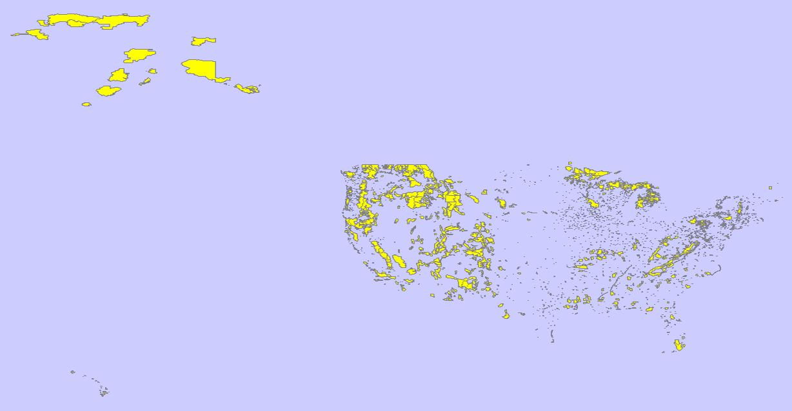
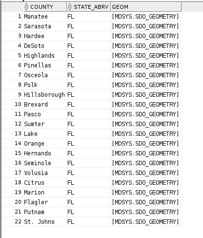
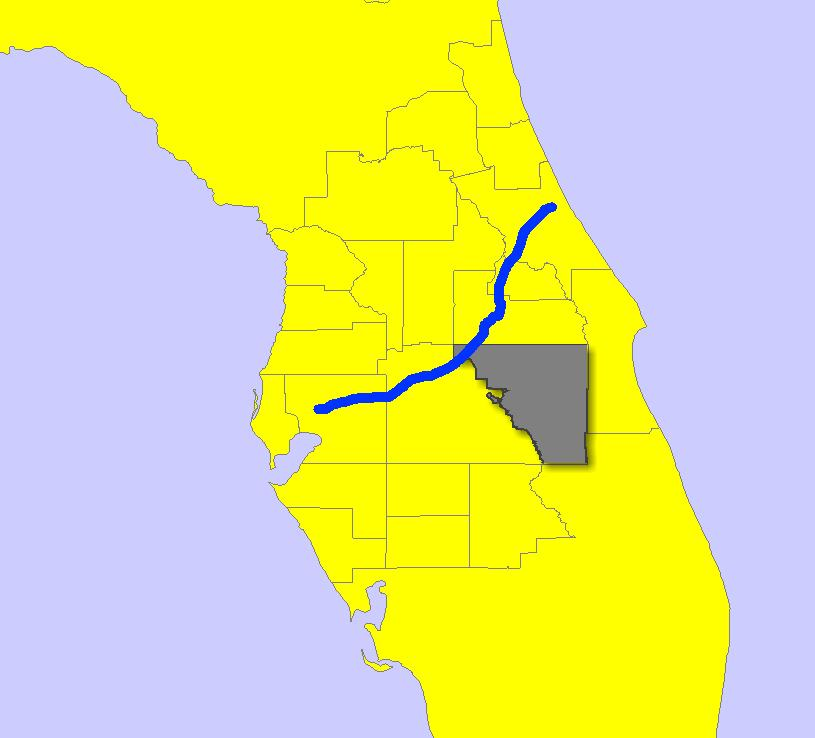

# Raport

# Przetwarzanie i analiza danych przestrzennych

# Oracle spatial

---

**Imiona i nazwiska: Bartłomiej Chwast, Jakub Domogała**

---

Celem ćwiczenia jest zapoznanie się ze sposobem przechowywania, przetwarzania i analizy danych przestrzennych w bazach danych
(na przykładzie systemu Oracle spatial)

Swoje odpowiedzi wpisuj w miejsca oznaczone jako:

---

> Wyniki, zrzut ekranu, komentarz

```sql
--  ...
```

---

Do wykonania ćwiczenia (zadania 1 – 7) i wizualizacji danych wykorzystaj Oracle SQL Develper. Alternatywnie możesz wykonać analizy w środowisku Python/Jupyter Notebook

Do wykonania zadania 8 wykorzystaj środowisko Python/Jupyter Notebook

Raport należy przesłać w formacie pdf.

Należy też dołączyć raport zawierający kod w formacie źródłowym.

Np.

- plik tekstowy .sql z kodem poleceń
- plik .md zawierający kod wersji tekstowej
- notebook programu jupyter – plik .ipynb

Zamieść kod rozwiązania oraz zrzuty ekranu pokazujące wyniki, (dołącz kod rozwiązania w formie tekstowej/źródłowej)

Zwróć uwagę na formatowanie kodu

<div style="page-break-after: always;"></div>

# Zadanie 1

Zwizualizuj przykładowe dane

---

US_STATES


```sql
SELECT * FROM us_states;
```

> 50 stanów USA

---

US_INTERSTATES


```sql
SELECT * FROM us_interstates;
```

> Autostrady międzystanowe są skoncentrowane w miejscach o większej gęstości zaludnienia, możemy to zauważyć na mapie,
> poprzez gęstszą siatkę w północno-wschodniej części kraju oraz na samym zachodnim wybrzeżu.

---

US_CITIES


```sql
SELECT * FROM us_cities;
```

> Miasta są skoncentrowane wzdłuż wybrzeży, wzdłuż rzek oraz w miejscach o większej gęstości zaludnienia.

---

US_RIVERS


```sql
SELECT * FROM us_rivers;
```

> Więcej rzek znajduje się w północno-wschodniej oraz w środkowej części kraju.

---

US_COUNTIES


```sql
SELECT * FROM us_counties;
```

> Hrabstwa są liczniejsze w miejscach o większej gęstości zaludnienia, widać to na przykład w północno-wschodniej części kraju.

---

US_PARKS



```sql
SELECT * FROM us_parks;
```

> Parki narodowe są skoncentrowane w miejscach o mniejszej gęstości zaludnienia, widać to na przykład w północno-zachodniej części kraju.

# Zadanie 2

Znajdź wszystkie stany (us_states) których obszary mają część wspólną ze wskazaną geometrią (prostokątem)

Pokaż wynik na mapie.

prostokąt

```sql
SELECT sdo_geometry (2003, 8307, null,
sdo_elem_info_array (1,1003,3),
sdo_ordinate_array ( -117.0, 40.0, -90., 44.0)) g
FROM dual
```

> Wyniki, zrzut ekranu, komentarz
> 

Użyj funkcji SDO_FILTER

```sql
SELECT state, geom FROM us_states
WHERE sdo_filter (geom,
sdo_geometry (2003, 8307, null,
sdo_elem_info_array (1,1003,3),
sdo_ordinate_array ( -117.0, 40.0, -90., 44.0))
) = 'TRUE';
```

Zwróć uwagę na liczbę zwróconych wierszy (16)

> Wyniki, zrzut ekranu, komentarz
> 

Użyj funkcji SDO_ANYINTERACT

```sql
SELECT state, geom FROM us_states
WHERE sdo_anyinteract (geom,
sdo_geometry (2003, 8307, null,
sdo_elem_info_array (1,1003,3),
sdo_ordinate_array ( -117.0, 40.0, -90., 44.0))
) = 'TRUE';
```

Porównaj wyniki sdo_filter i sdo_anyinteract

Pokaż wynik na mapie

> Wyniki, zrzut ekranu, komentarz
> 

```
na zółto widzimy wystające części wyniku funkcji filter, zielonawy kolor przedstawia wyniki anyinteract
```

```
funkcja sdo_anyinteract daje lepsze wyniki, funkcja filter znajduje stany które w ogóle nie dotykają naszego prostokąta.

Dzieje się tak poniewaz funkcja filter robi filtracje na bazie bounding box'u, a nie dokładnej geometrii obiektów.
Jest to obliczeniowo o wiele lzejszy proces, ale nie da nam idealnych wynikow.
Potencjalnie najbardziej optymalnym podejsciem wydaje sie najpierw uzycie funkcji filter(bo jest szybka) na całym zbiorze danych, a następnie funkcji anyinteract na wyniku funkcji filter. To pozwoliłoby nam wykonać najmniej obliczeń przy zachowaniu maksymalnej dokładności wyników.
```

# Zadanie 3

Znajdź wszystkie parki (us_parks) których obszary znajdują się wewnątrz stanu Wyoming

Użyj funkcji SDO_INSIDE

```sql
SELECT p.name, p.geom
FROM us_parks p, us_states s
WHERE s.state = 'Wyoming'
AND SDO_INSIDE (p.geom, s.geom ) = 'TRUE';
```

> 

W przypadku wykorzystywania narzędzia SQL Developer, w celu wizualizacji na mapie użyj podzapytania

```sql
SELECT pp.name, pp.geom FROM us_parks pp
WHERE id IN
(
 SELECT p.id
 FROM us_parks p, us_states s
 WHERE s.state = 'Wyoming'
 and SDO_INSIDE (p.geom, s.geom ) = 'TRUE'
)
```

> Wyniki, zrzut ekranu, komentarz
> 

```sql
SELECT state, geom FROM us_states
WHERE state = 'Wyoming'
```

> Wyniki, zrzut ekranu, komentarz
> 

Porównaj wynik z:

```sql
SELECT p.name, p.geom
FROM us_parks p, us_states s
WHERE s.state = 'Wyoming'
AND SDO_ANYINTERACT (p.geom, s.geom ) = 'TRUE';
```

W celu wizualizacji użyj podzapytania

> Wyniki, zrzut ekranu, komentarz
> 

```
Tak jak mozna się spodziewać funkcja anyinteract daje nam w wyniku nie tylko parki zawiejające się w środku obszaru, ale równiez te które jedynie częściowo o ten obszar zahaczają.
```

```sql
select pp.name, pp.geom from us_parks pp
where id IN
(
    select p.id
    from us_parks p, us_states s
    where s.state = 'Wyoming'
    and SDO_ANYINTERACT (p.geom, s.geom) = 'TRUE'
);
```

# Zadanie 4

Znajdź wszystkie jednostki administracyjne (us_counties) wewnątrz stanu New Hampshire

```sql
SELECT c.county, c.state_abrv, c.geom
FROM us_counties c, us_states s
WHERE s.state = 'New Hampshire'
AND SDO_RELATE ( c.geom,s.geom, 'mask=INSIDE+COVEREDBY') = 'TRUE';

SELECT c.county, c.state_abrv, c.geom
FROM us_counties c, us_states s
WHERE s.state = 'New Hampshire'
AND SDO_RELATE ( c.geom,s.geom, 'mask=INSIDE') = 'TRUE';

SELECT c.county, c.state_abrv, c.geom
FROM us_counties c, us_states s
WHERE s.state = 'New Hampshire'
AND SDO_RELATE ( c.geom,s.geom, 'mask=COVEREDBY') = 'TRUE';
```

W przypadku wykorzystywania narzędzia SQL Developer, w celu wizualizacji danych na mapie należy użyć podzapytania (podobnie jak w poprzednim zadaniu)

Obie maski

> 

Maska Inside

> 

Maska CoveredBy

> 

```
Maski dają nam jako wyniki zbiory rozłączne które dają nam jako sumę ten sam obszar co uzycie ich obu w osobnych zapytaniach. Co jednak dziwne to funkcja coveredby powinna zwracać pełny zbiór zwracany przez INSIDE + dodatkowe elementy dotykające granic obszaru, jednak tak się nie dzieje. Z tego mozna wnioskowac ze funkcja covered by zwraca tylko wyniki dotykające granic z wyłączeniem tych które są wewnątrz ale granic nie dotykają.
```

Zmodyfikowane zapytania

```sql
SELECT pp.county, pp.state_abrv, pp.geom from us_counties pp
where id IN
(
    select c.id
    FROM us_counties c, us_states s
    WHERE s.state = 'New Hampshire'
    AND SDO_RELATE ( c.geom,s.geom, 'mask=INSIDE+COVEREDBY') = 'TRUE'
);

SELECT pp.county, pp.state_abrv, pp.geom from us_counties pp
where id IN
(
    select c.id
    FROM us_counties c, us_states s
    WHERE s.state = 'New Hampshire'
    AND SDO_RELATE ( c.geom,s.geom, 'mask=INSIDE') = 'TRUE'
);

SELECT pp.county, pp.state_abrv, pp.geom from us_counties pp
where id IN
(
    select c.id
    FROM us_counties c, us_states s
    WHERE s.state = 'New Hampshire'
    AND SDO_RELATE ( c.geom,s.geom, 'mask=COVEREDBY') = 'TRUE'
);
```

# Zadanie 5

Znajdź wszystkie miasta w odległości 50 mili od drogi (us_interstates) I4

Pokaż wyniki na mapie

```sql
SELECT * FROM us_interstates
WHERE interstate = 'I4'

SELECT * FROM us_states
WHERE state_abrv = 'FL'

SELECT c.city, c.state_abrv, c.location
FROM us_cities c
WHERE ROWID IN
(
SELECT c.rowid
FROM us_interstates i, us_cities c
WHERE i.interstate = 'I4'
AND sdo_within_distance (c.location, i.geom,'distance=50 unit=mile'
)
```

```sql
SELECT c.city, c.state_abrv, c.location
FROM us_cities c
WHERE ROWID IN
(
    SELECT c.rowid
    FROM us_interstates i, us_cities c
    WHERE i.interstate = 'I4'
    AND sdo_within_distance (c.location, i.geom,'distance=50 unit=mile') = 'TRUE'
);
```


Dodatkowo:

---

a) Znajdz wszystkie jednostki administracyjne przez które przechodzi droga I4

```sql
SELECT c.county, c.state_abrv, c.geom
FROM us_counties c
WHERE ROWID IN
(
    SELECT c.rowid
    FROM us_counties c, us_interstates i
    WHERE SDO_ANYINTERACT(c.geom, i.geom) = 'TRUE'
    AND i.interstate = 'I4'
);
```


---

b) Znajdz wszystkie jednostki administracyjne w pewnej odległości od I4

```sql
SELECT c.county, c.state_abrv, c.geom
FROM us_counties c
WHERE ROWID IN
(
    SELECT c.rowid
    FROM us_counties c, us_interstates i
    WHERE SDO_WITHIN_DISTANCE(c.geom, i.geom, 'distance=50 unit=mile') = 'TRUE'
    AND i.interstate = 'I4'
);
```




---

c) Znajdz rzeki które przecina droga I4

```sql
SELECT r.name, r.geom
FROM us_rivers r
WHERE ROWID IN
(
    SELECT r.rowid
    FROM us_rivers r, us_interstates i
    WHERE SDO_ANYINTERACT(r.geom, i.geom) = 'TRUE'
    AND i.interstate = 'I4'
);
```


---

d) Znajdz wszystkie drogi które przecinają rzekę Mississippi

```sql
SELECT i.interstate, i.geom
FROM us_interstates i
WHERE ROWID IN
(
    SELECT i.rowid
    FROM us_rivers r, us_interstates i
    WHERE SDO_ANYINTERACT(r.geom, i.geom) = 'TRUE'
    AND r.name = 'Mississippi'
)
```


---

e) Znajdz wszystkie miasta w odlegości od 15 do 30 mil od drogi 'I275'

```sql
SELECT c.city, c.state_abrv, c.location
FROM us_cities c
WHERE ROWID IN
(
    SELECT c.rowid
    FROM us_interstates i, us_cities c
    WHERE i.interstate = 'I275'
    AND sdo_within_distance (c.location, i.geom,'distance=30 unit=mile') = 'TRUE'
    MINUS
    SELECT c.rowid
    FROM us_interstates i, us_cities c
    WHERE i.interstate = 'I275'
    AND sdo_within_distance (c.location, i.geom,'distance=15 unit=mile') = 'TRUE'
)
```


---

f) Itp. (własne przykłady)
f) znajdź wszystkie jednostki administracyjne w odległości od 20 do 50 kilometrów od miasta Detroit

> Wyniki, zrzut ekranu, komentarz
> (dla każdego z podpunktów)

```sql
SELECT c.county, c.state_abrv, c.geom
FROM us_counties c
WHERE ROWID IN
(
    SELECT a.rowid
    FROM us_counties a, us_cities b
    WHERE SDO_WITHIN_DISTANCE(a.geom, b.location, 'distance=50 unit=KM') = 'TRUE'
    AND b.city = 'Detroit'
    MINUS

    SELECT a.rowid
    FROM us_counties a, us_cities b
    WHERE SDO_WITHIN_DISTANCE(a.geom, b.location, 'distance=20 unit=KM') = 'TRUE'
    AND b.city = 'Detroit'
)
--  ...
```


# Zadanie 6

Znajdz 5 miast najbliższych drogi I4

```sql
SELECT c.city, c.state_abrv, c.location
FROM us_interstates i, us_cities c
WHERE i.interstate = 'I4'
AND sdo_nn(c.location, i.geom, 'sdo_num_res=5') = 'TRUE';
```

> Wyniki, zrzut ekranu, komentarz

```sql
SELECT c.city, c.state_abrv, c.location
FROM us_cities c
WHERE ROWID IN
(
    SELECT c.rowid
    FROM us_interstates i, us_cities c
    WHERE i.interstate = 'I4'
    AND sdo_nn(c.location, i.geom, 'sdo_num_res=5') = 'TRUE'
)
```


Dodatkowo:

---

a) Znajdz kilka miast najbliższych rzece Mississippi

```sql
SELECT c.city, c.state_abrv, c.location
FROM us_cities c
WHERE ROWID IN
(
    SELECT c.rowid
    FROM us_rivers r, us_cities c
    WHERE r.name = 'Mississippi'
    AND sdo_nn(c.location, r.geom, 'sdo_num_res=5') = 'TRUE'
)
```


---

b) Znajdz 3 miasta najbliżej Nowego Jorku

```sql
SELECT c.city, c.state_abrv, c.location
FROM us_cities c
WHERE ROWID IN
(
    SELECT c.rowid
    FROM us_cities c
    WHERE c.city != 'New York'
    AND sdo_nn(c.location,
        (SELECT location FROM us_cities WHERE city = 'New York'),
         'sdo_num_res=4') = 'TRUE'
)
```


---

c) Znajdz kilka jednostek administracyjnych (us_counties) z których jest najbliżej do Nowego Jorku

```sql
SELECT c.county, c.state_abrv, c.geom
FROM us_counties c
WHERE ROWID IN
(
    SELECT c.rowid
    FROM us_counties c, us_cities ci
    WHERE ci.city = 'New York'
    AND sdo_nn(c.geom, ci.location, 'sdo_num_res=5') = 'TRUE'
)
```


---

d) Znajdz 5 najbliższych miast od drogi 'I170', podaj odległość do tych miast

```sql
SELECT c.city, c.state_abrv, c.location
FROM us_cities c
WHERE ROWID IN
(
    SELECT c.rowid
    FROM us_interstates i, us_cities c
    WHERE i.interstate = 'I170'
    AND sdo_nn(c.location, i.geom, 'sdo_num_res=5') = 'TRUE'
)
```

```sql
SELECT c.city, c.state_abrv, c.location,
       sdo_geom.sdo_distance(c.location, i.geom, 0.005, 'unit=KM') distance
FROM us_cities c, us_interstates i
WHERE i.interstate = 'I170'
AND sdo_nn(c.location, i.geom, 'sdo_num_res=5') = 'TRUE'
ORDER BY distance;
```


---

e) Znajdz 5 najbliższych dużych miast (o populacji powyżej 300 tys) od drogi 'I170'

```sql
SELECT c.city, c.state_abrv, c.location
FROM us_cities c
WHERE ROWID IN
(
    SELECT r FROM
    (
        SELECT c.rowid r, c.city, sdo_geom.sdo_distance(c.location, i.geom, 0.005, 'unit=KM') distance
        FROM us_cities c, us_interstates i
        WHERE i.interstate = 'I170' AND c.pop90 > 300000
        ORDER BY distance
    )
    WHERE ROWNUM <= 5
)
```


---

f) Itp. (własne przykłady)
f) Znajdź 5 najblizszych rzek od Denver

> Wyniki, zrzut ekranu, komentarz
> (dla każdego z podpunktów)

```sql
SELECT r.name, r.geom
FROM us_rivers r
WHERE ROWID IN
(
    SELECT r.rowid
    FROM us_rivers r, us_cities c
    WHERE c.city = 'Denver'
    AND sdo_nn(r.geom, c.location, 'sdo_num_res=5') = 'TRUE'
)
```


# Zadanie 7

Oblicz długość drogi I4

```sql
SELECT SDO_GEOM.SDO_LENGTH (geom, 0.5,'unit=kilometer') length
FROM us_interstates
WHERE interstate = 'I4';
```


Dodatkowo:

---

a) Oblicz długość rzeki Mississippi

```sql
SELECT SDO_GEOM.SDO_LENGTH (geom, 0.5,'unit=kilometer') length
FROM us_rivers
WHERE name = 'Mississippi';
```


---

b) Która droga jest najdłuższa/najkrótsza

```sql
SELECT interstate, SDO_GEOM.SDO_LENGTH (geom, 0.5,'unit=kilometer') length
FROM us_interstates
ORDER BY length DESC
FETCH FIRST 1 ROW ONLY;

SELECT interstate, SDO_GEOM.SDO_LENGTH (geom, 0.5,'unit=kilometer') length
FROM us_interstates
ORDER BY length
FETCH FIRST 1 ROW ONLY;
```


---

c) Która rzeka jest najdłuższa/najkrótsza

```sql
SELECT name, SDO_GEOM.SDO_LENGTH (geom, 0.5,'unit=kilometer') length
FROM us_rivers
ORDER BY length DESC
FETCH FIRST 1 ROW ONLY;

SELECT name, SDO_GEOM.SDO_LENGTH (geom, 0.5,'unit=kilometer') length
FROM us_rivers
ORDER BY length
FETCH FIRST 1 ROW ONLY;
```


---

d) Które stany mają najdłuższą granicę

```sql
SELECT state, SDO_GEOM.SDO_LENGTH (geom, 0.5,'unit=kilometer') length
FROM us_states
ORDER BY length DESC
FETCH FIRST 5 ROW ONLY;
```


---

e) Itp. (własne przykłady)

> Wyniki, zrzut ekranu, komentarz
> (dla każdego z podpunktów)

```sql
--  ...
```

Oblicz odległość między miastami Buffalo i Syracuse

```sql
SELECT SDO_GEOM.SDO_DISTANCE ( c1.location, c2.location, 0.5) distance
FROM us_cities c1, us_cities c2
WHERE c1.city = 'Buffalo' and c2.city = 'Syracuse';
```


Dodatkowo:

---

a) Oblicz odległość między miastem Tampa a drogą I4

```sql
SELECT SDO_GEOM.SDO_DISTANCE ( c.location, i.geom, 0.5) distance
FROM us_cities c, us_interstates i
WHERE c.city = 'Tampa' and i.interstate = 'I4';
```


---

b) Jaka jest odległość z między stanem Nowy Jork a Florydą

```sql
SELECT SDO_GEOM.SDO_DISTANCE(s1.geom, s2.geom, 0.5) distance
FROM us_states s1, us_states s2
WHERE s1.state = 'New York' AND s2.state = 'Florida';
```


---

c) Jaka jest odległość z między miastem Nowy Jork a Florydą

```sql
SELECT SDO_GEOM.SDO_DISTANCE(s.geom, c.location, 0.5) distance
FROM us_states s, us_cities c
WHERE c.city = 'New York' AND s.state = 'Florida';
```


---

d) Podaj 3 parki narodowe do których jest najbliżej z Nowego Jorku, oblicz odległości do tych parków

```sql
SELECT p.name, SDO_GEOM.SDO_DISTANCE(p.geom, c.location, 0.5) distance
FROM us_parks p, us_cities c
WHERE c.city = 'New York'
ORDER BY distance
FETCH FIRST 3 ROWS ONLY;
```


---

e) Przetestuj działanie funkcji

a. sdo_intersection, sdo_union, sdo_difference

b. sdo_buffer

c. sdo_centroid, sdo_mbr, sdo_convexhull, sdo_simplify

f) Itp. (własne przykłady)

> Wyniki, zrzut ekranu, komentarz
> (dla każdego z podpunktów)

```sql
--  ...
```

Zadanie 8

Wykonaj kilka własnych przykładów/analiz

> Wyniki, zrzut ekranu, komentarz

```sql
--  ...
```

Punktacja

|       |     |
| ----- | --- |
| zad   | pkt |
| 1     | 0,5 |
| 2     | 1   |
| 3     | 1   |
| 4     | 1   |
| 5     | 3   |
| 6     | 3   |
| 7     | 6   |
| 8     | 4   |
| razem | 20  |
