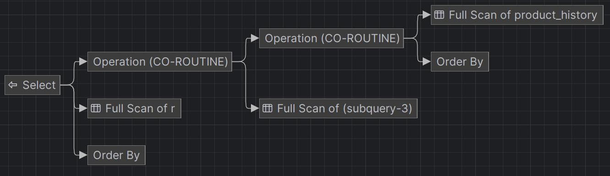
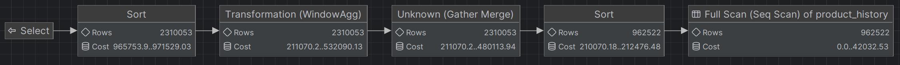

# SQL - Funkcje okna (Window functions)

# Lab 1-2-3

---

**Imię i nazwisko:** Bartłomiej Chwast, Jakub Domogała

---

Celem ćwiczenia jest zapoznanie się z działaniem funkcji okna (window functions) w SQL, analiza wydajności zapytań i porównanie z rozwiązaniami przy wykorzystaniu "tradycyjnych" konstrukcji SQL

Swoje odpowiedzi wpisuj w miejsca oznaczone jako:

```sql
-- wyniki ...
```

Ważne/wymagane są komentarze.

Zamieść kod rozwiązania oraz zrzuty ekranu pokazujące wyniki, (dołącz kod rozwiązania w formie tekstowej/źródłowej)

Zwróć uwagę na formatowanie kodu

---

## Oprogramowanie - co jest potrzebne?

Do wykonania ćwiczenia potrzebne jest następujące oprogramowanie:

- MS SQL Server - wersja 2019, 2022
- PostgreSQL - wersja 15/16
- SQLite
- Narzędzia do komunikacji z bazą danych
  - SSMS - Microsoft SQL Managment Studio
  - DtataGrip lub DBeaver
- Przykładowa baza Northwind
  - W wersji dla każdego z wymienionych serwerów

Oprogramowanie dostępne jest na przygotowanej maszynie wirtualnej

## Dokumentacja/Literatura

- Kathi Kellenberger, Clayton Groom, Ed Pollack, Expert T-SQL Window Functions in SQL Server 2019, Apres 2019
- Itzik Ben-Gan, T-SQL Window Functions: For Data Analysis and Beyond, Microsoft 2020

- Kilka linków do materiałów które mogą być pomocne - https://learn.microsoft.com/en-us/sql/t-sql/queries/select-over-clause-transact-sql?view=sql-server-ver16

  - https://www.sqlservertutorial.net/sql-server-window-functions/
  - https://www.sqlshack.com/use-window-functions-sql-server/
  - https://www.postgresql.org/docs/current/tutorial-window.html
  - https://www.postgresqltutorial.com/postgresql-window-function/
  - https://www.sqlite.org/windowfunctions.html
  - https://www.sqlitetutorial.net/sqlite-window-functions/

- Ikonki używane w graficznej prezentacji planu zapytania w SSMS opisane są tutaj:
  - [https://docs.microsoft.com/en-us/sql/relational-databases/showplan-logical-and-physical-operators-reference](https://docs.microsoft.com/en-us/sql/relational-databases/showplan-logical-and-physical-operators-reference)

---

# Zadanie 1 - obserwacja

Wykonaj i porównaj wyniki następujących poleceń.

```sql
select avg(unitprice) avgprice
from products p;

select avg(unitprice) over () as avgprice
from products p;

select categoryid, avg(unitprice) avgprice
from products p
group by categoryid

select avg(unitprice) over (partition by categoryid) as avgprice
from products p;
```

Jaka jest są podobieństwa, jakie różnice pomiędzy grupowaniem danych a działaniem funkcji okna?

```
W wyniku pierwszego zapytania otrzymaliśmy jedną wartość - średnią cenę wszystkich produktów.
W wyniku drugiego zapytania otrzymaliśmy tyle samo wartości ile w tabeli, ale wszystkie są równe średniej cenie wszystkich produktów.
W wyniku trzeciego zapytania otrzymaliśmy średnią cenę produktów w każdej kategorii.
W wyniku czwartego zapytania otrzymaliśmy tyle samo wartości ile w tabeli, ale wszystkie są równe średniej cenie produktów w danej kategorii.

Zarówno funkcja okna jak i grupowanie danych pozwala na uzyskanie wyników dla grupy wierszy.
W przypadku grupowania wynik jest obliczany dla każdej grupy, a w przypadku funkcji okna wynik jest obliczany dla każdego wiersza w grupie.
```

---

# Zadanie 2 - obserwacja

Wykonaj i porównaj wyniki następujących poleceń.

```sql
--1)

select p.productid, p.ProductName, p.unitprice,
	(select avg(unitprice) from products) as avgprice
from products p
where productid < 10

--2)
select p.productid, p.ProductName, p.unitprice,
	 avg(unitprice) over () as avgprice
from products p
where productid < 10
```

Jaka jest różnica? Czego dotyczy warunek w każdym z przypadków? Napisz polecenie równoważne

- 1. z wykorzystaniem funkcji okna. Napisz polecenie równoważne
- 2. z wykorzystaniem podzapytania

```
W wyniku pierwszego zapytania otrzymaliśmy średnią cenę wszystkich produktów dla każdego produktu, który ma id mniejsze niż 10.
W wyniku drugiego zapytania otrzymaliśmy średnią cenę produktów, które mają id mniejze niż 10, dla każdego produktu, który ma id mniejsze niż 10.

W pierwszym zapytaniu warunek nie dotyczył podzapytania, a w drugim zapytaniu warunek dotyczył funkcji okna.
```

```sql
-- Polecenie równoważne 1) z wykorzystaniem funkcji okna:
with av as (
    select p.productid, p.ProductName, p.unitprice,
       avg(unitprice) over () as avgprice
    from products p
)
select * from av
where productid < 10

-- Polecenie równoważne 2) z wykorzystaniem podzapytania:
select p.productid, p.ProductName, p.unitprice,
	(select avg(unitprice) from products where productid < 10) as avgprice
from products p
where productid < 10
```

# Zadanie 3

Baza: Northwind, tabela: products

Napisz polecenie, które zwraca: id produktu, nazwę produktu, cenę produktu, średnią cenę wszystkich produktów.

Napisz polecenie z wykorzystaniem z wykorzystaniem podzapytania, join'a oraz funkcji okna. Porównaj czasy oraz plany wykonania zapytań.

Przetestuj działanie w różnych SZBD (MS SQL Server, PostgreSql, SQLite)

W SSMS włącz dwie opcje: Include Actual Execution Plan oraz Include Live Query Statistics


W DataGrip użyj opcji Explain Plan/Explain Analyze


```sql
-- podzapytanie
select p.productId, p.productName, p.unitPrice,
       (select avg(unitprice) from products) as avgPrice
from products p;

-- join
with av as (
    select p.productId,
        (select avg(unitprice) from products) as avgPrice
    from products p
)
select p.productId, p.productName, p.unitPrice,
         av.avgPrice
from products p
inner join av on p.productId = av.productId;

-- funkcja okna
select p.productId, p.productName, p.unitPrice,
       avg(unitprice) over () as avgPrice
from products p;
```

### MSSQL

Podzapytanie\

Join\

Funkcja okna\


### SQLite

Podzapytanie\

Join\

Funkcja okna\


---

### PostgreSQL

Podzapytanie\

Join\

Funkcja okna\


---

---

# Zadanie 4

Baza: Northwind, tabela products

Napisz polecenie, które zwraca: id produktu, nazwę produktu, cenę produktu, średnią cenę produktów w kategorii, do której należy dany produkt. Wyświetl tylko pozycje (produkty) których cena jest większa niż średnia cena.

Napisz polecenie z wykorzystaniem podzapytania, join'a oraz funkcji okna. Porównaj zapytania. Porównaj czasy oraz plany wykonania zapytań.

Przetestuj działanie w różnych SZBD (MS SQL Server, PostgreSql, SQLite)

```sql
-- podzapytanie
select p.productId, p.productName, p.unitPrice,
       (select avg(unitprice) from products where CategoryID = p.CategoryID) as avgPrice
from products p
where p.unitPrice > (select avg(unitprice) from products where CategoryID = p.CategoryID);

-- join
with av as (
    select p.categoryId, avg(unitprice) avgPrice
    from products p
    group by p.categoryId
)
select p.productId, p.productName, p.unitPrice, av.avgPrice
from products p
inner join av on p.CategoryID = av.CategoryID
where p.unitPrice > av.avgPrice;

-- funkcja okna
with av as (
    select p.productId, p.productName, p.unitPrice,
           avg(unitprice) over (partition by CategoryID) as avgPrice
    from products p
)
select * from av
where unitPrice > avgPrice;
```

### MSSQL

Podzapytanie\

Join\

Funkcja okna\


### SQLite

Podzapytanie\

Join\

Funkcja okna\


---

### PostgreSQL

Podzapytanie\

Join\

Funkcja okna\


---

# Zadanie 5 - przygotowanie

Baza: Northwind

Tabela products zawiera tylko 77 wiersz. Warto zaobserwować działanie na większym zbiorze danych.

Wygeneruj tabelę zawierającą kilka milionów (kilkaset tys.) wierszy

Stwórz tabelę o następującej strukturze:

Skrypt dla SQL Srerver

```sql
create table product_history(
		 id int identity(1,1) not null,
		 productid int,
		 productname varchar(40) not null,
		 supplierid int null,
		 categoryid int null,
		 quantityperunit varchar(20) null,
		 unitprice decimal(10,2) null,
		 quantity int,
		 value decimal(10,2),
		 date date,
	constraint pk_product_history primary key clustered
			 (id asc )
)
```

Wygeneruj przykładowe dane:

Dla 30000 iteracji, tabela będzie zawierała nieco ponad 2mln wierszy (dostostu ograniczenie do możliwości swojego komputera)

Skrypt dla SQL Srerver

```sql
declare @i int
set @i = 1
while @i <= 30000
begin
    insert product_history
    select productid, ProductName, SupplierID, CategoryID,
         QuantityPerUnit,round(RAND()*unitprice + 10,2),
         cast(RAND() * productid + 10 as int), 0,
         dateadd(day, @i, '1940-01-01')
    from products
    set @i = @i + 1;
end;

update product_history
set value = unitprice * quantity
where 1=1;
```

Skrypt dla Postgresql

```sql
create table product_history(
		 id int generated always as identity not null
						 constraint pkproduct_history
											 primary key,
		 productid int,
		 productname varchar(40) not null,
		 supplierid int null,
		 categoryid int null,
		 quantityperunit varchar(20) null,
		 unitprice decimal(10,2) null,
		 quantity int,
		 value decimal(10,2),
		 date date
);
```

Wygeneruj przykładowe dane:

Skrypt dla Postgresql

```sql
do $$
begin
  for cnt in 1..30000 loop
    insert into product_history(productid, productname, supplierid,
           categoryid, quantityperunit,
           unitprice, quantity, value, date)
    select productid, productname, supplierid, categoryid,
           quantityperunit,
           round((random()*unitprice + 10)::numeric,2),
           cast(random() * productid + 10 as int), 0,
           cast('1940-01-01' as date) + cnt
    from products;
  end loop;
end; $$;

update product_history
set value = unitprice * quantity
where 1=1;
```

Wykonaj polecenia: `select count(*) from product_history`, potwierdzające wykonanie zadania

MSSQL\
\
Postgresql\
\
SQLite\


---

# Zadanie 6

Baza: Northwind, tabela product_history

To samo co w zadaniu 3, ale dla większego zbioru danych

Napisz polecenie, które zwraca: id pozycji, id produktu, nazwę produktu, cenę produktu, średnią cenę produktów w kategorii do której należy dany produkt. Wyświetl tylko pozycje (produkty) których cena jest większa niż średnia cena.

Napisz polecenie z wykorzystaniem podzapytania, join'a oraz funkcji okna. Porównaj zapytania. Porównaj czasy oraz plany wykonania zapytań.

Przetestuj działanie w różnych SZBD (MS SQL Server, PostgreSql, SQLite)

```sql
-- podzapytanie
select p.id, p.productId, p.productName, p.unitPrice,
       (select avg(unitprice) from product_history where CategoryID = p.CategoryID) as avgPrice
from product_history p
where p.unitPrice > (select avg(unitprice) from products where CategoryID = p.CategoryID);

-- join
with av as (
    select p.categoryId, avg(unitprice) avgPrice
    from product_history p
    group by p.categoryId
)
select p.id, p.productId, p.productName, p.unitPrice, av.avgPrice
from product_history p
inner join av on p.CategoryID = av.CategoryID
where p.unitPrice > av.avgPrice;

-- funkcja okna
with av as (
    select p.id, p.productId, p.productName, p.unitPrice,
           avg(unitprice) over (partition by CategoryID) as avgPrice
    from product_history p
)
select * from av
where unitPrice > avgPrice;
```

```
MSSQL
Podzapytanie - wyniki przyrostowe (100 wierszy co ok. 500 milisekund)
Join - wyniki przyrostowe (100 wierszy co ok. 800 milisekund)
Funkcja okna - wyniki przyrostowe (100 wierszy co ok. 950 milisekund)

SQLite
Podzapytanie - wyniki przyrostowe (100 wierszy co ok. 20 sekund)
Join - wyniki przyrostowe (100 wierszy co ok. 120 milisekund)
Funkcja okna - wyniki przyrostowe (100 wierszy co ok. 160 milisekund)

PostgreSQL
Podzapytanie - za długo aby ocenić
Join - wyniki przyrostowe (100 wierszy co ok. 160 milisekund)
Funkcja okna - wyniki przyrostowe (100 wierszy co ok. 400 milisekund)
```

---

# Zadanie 7

Baza: Northwind, tabela product_history

Lekka modyfikacja poprzedniego zadania

Napisz polecenie, które zwraca: id pozycji, id produktu, nazwę produktu, cenę produktu oraz

- średnią cenę produktów w kategorii do której należy dany produkt.
- łączną wartość sprzedaży produktów danej kategorii (suma dla pola value)
- średnią cenę danego produktu w roku którego dotyczy dana pozycja
- łączną wartość sprzedaży produktów danej kategorii (suma dla pola value)

Napisz polecenie z wykorzystaniem podzapytania, join'a oraz funkcji okna. Porównaj zapytania. W przypadku funkcji okna spróbuj użyć klauzuli WINDOW.

Porównaj czasy oraz plany wykonania zapytań.

Przetestuj działanie w różnych SZBD (MS SQL Server, PostgreSql, SQLite)

```sql
-- podzapytanie
select p.id, p.productId, p.productName, p.unitPrice,
    (select avg(unitprice) from product_history where categoryId = p.categoryId) as avgCatPrice,
    (select sum(value) from product_history where categoryid = p.categoryId) as totalValue,
    (select avg(unitprice) from product_history where productId = p.productId and year(date) = year(p.date)) as avgYearPrice
from product_history p;

-- join
with av1 as (select p.categoryId, avg(unitprice) avgCatPrice, sum(value) totalValue
             from product_history p
             group by p.categoryId
)
with av2 as (
    select p.productId, year(p.date) year, avg(unitprice) avgYearPrice
    from product_history p
    group by p.productId, year(p.date)
)
select p.id, p.productId, p.productName, p.unitPrice, av1.avgCatPrice, av1.totalValue, av2.avgYearPrice
from product_history p
inner join av1 on p.CategoryID = av1.CategoryID
inner join av2 on p.productId = av2.productId and year(p.date) = av2.year;

-- funkcja okna
select p.id, p.productId, p.productName, p.unitPrice,
    avg(unitprice) over w as avgCatPrice,
    sum(value) over w as totalValue,
    avg(unitprice) over (partition by p.productId, year(p.date)) as avgYearPrice
from product_history p
window w as (partition by p.categoryId);
```

```
MSSQL
Podzapytanie - za długo aby ocenić
Join - wyniki przyrostowe (100 wierszy co ok. 3 sekundy)
Funkcja okna - did't work at all

SQLite
Podzapytanie - za długo aby ocenić
Join - wyniki przyrostowe (100 wierszy co ok. 800 milisekund)
Funkcja okna - wyniki przyrostowe (100 wierszy co ok. 650 milisekund)

PostgreSQL
Podzapytanie - za długo aby ocenić
Join - did't work at all
Funkcja okna - wyniki przyrostowe (100 wierszy co ok. 800 milisekund)
```

---

# Zadanie 8 - obserwacja

Funkcje rankingu, `row_number()`, `rank()`, `dense_rank()`

Wykonaj polecenie, zaobserwuj wynik. Porównaj funkcje row_number(), rank(), dense_rank()

```sql
select productid, productname, unitprice, categoryid,
    row_number() over(partition by categoryid order by unitprice desc) as rowno,
    rank() over(partition by categoryid order by unitprice desc) as rankprice,
    dense_rank() over(partition by categoryid order by unitprice desc) as denserankprice
from products;
```

```
row_number() - unikalny numer dla kazdego w partycji
rank() - te same rangi dla powiązanych i odpowiednio przeskakuje rangi przy tym
dense_rank() - te same rangi dla powiązanych i odpowiednio nie przeskakuje rangi przy tym
```

Zadanie

Spróbuj uzyskać ten sam wynik bez użycia funkcji okna

```sql
select p.productid, p.productname, p.unitprice, p.categoryid,
    (select count(*) from products
        where p.categoryId = CategoryID
        and (p.UnitPrice < UnitPrice or (p.UnitPrice = UnitPrice and p.ProductID > ProductID))) + 1 as rowno,
    (select count(*) from products
        where p.categoryId = CategoryID
        and p.UnitPrice < UnitPrice) + 1 as rankprice,
    (select count(distinct UnitPrice) from products
        where p.categoryId = CategoryID and p.UnitPrice < UnitPrice) + 1 as denserankprice
from products p
order by p.CategoryID, p.UnitPrice desc, p.ProductID;
```

---

# Zadanie 9

Baza: Northwind, tabela product_history

Dla każdego produktu, podaj 4 najwyższe ceny tego produktu w danym roku. Zbiór wynikowy powinien zawierać:

- rok
- id produktu
- nazwę produktu
- cenę
- datę (datę uzyskania przez produkt takiej ceny)
- pozycję w rankingu

Uporządkuj wynik wg roku, nr produktu, pozycji w rankingu

```sql
with r as (
    select year(date) as year, productid, productname, unitprice, date,
        rank() over (partition by productid, year(date) order by unitprice desc) as rankprice
    from product_history
)
select * from r
where rankprice <= 4
order by year, productid, rankprice;
```

Spróbuj uzyskać ten sam wynik bez użycia funkcji okna, porównaj wyniki, czasy i plany zapytań. Przetestuj działanie w różnych SZBD (MS SQL Server, PostgreSql, SQLite)

```sql
with r as (
    select year(p.date) as year, p.productid, p.productname, p.unitprice, p.date,
        (select count(*) from product_history
            where year(date) = year(p.date)
                and productid = p.productid
                and (unitprice > p.unitprice)) + 1 as rankprice
from product_history p
)
select * from r
where rankprice <= 4
order by year, productid, rankprice;
```

```
MSSQL
z over - wyniki przyrostowe (500 wierszy 450 milisekund)
```


```
bez over - za długo
```

```

SQLite
z over - wyniki przyrostowe (500 wierszy 1870 milisekund)

```



```
bez over - za długo
```

```

PostgreSQL
z over - wyniki przyrostowe (500 wierszy 9 sekund)
```



```
bez over - za długo

```

---

# Zadanie 10 - obserwacja

Funkcje `lag()`, `lead()`

Wykonaj polecenia, zaobserwuj wynik. Jak działają funkcje `lag()`, `lead()`

```sql
select productid, productname, categoryid, date, unitprice,
       lag(unitprice) over (partition by productid order by date)
as previousprodprice,
       lead(unitprice) over (partition by productid order by date)
as nextprodprice
from product_history
where productid = 1 and year(date) = 2022
order by date;

with t as (select productid, productname, categoryid, date, unitprice,
                  lag(unitprice) over (partition by productid
order by date) as previousprodprice,
                  lead(unitprice) over (partition by productid
order by date) as nextprodprice
           from product_history
           )
select * from t
where productid = 1 and year(date) = 2022
order by date;
```

```
Drugie zapytanie działa lepiej, jednak jego wykonanie zajmuje dwa razy więcej czasu
1. 140 milisekund
2. 290 milisekund
```

Zadanie

Spróbuj uzyskać ten sam wynik bez użycia funkcji okna, porównaj wyniki, czasy i plany zapytań. Przetestuj działanie w różnych SZBD (MS SQL Server, PostgreSql, SQLite)

```sql
select p.productid, p.productname, p.categoryid, p.date, p.unitprice,
   (select unitprice from product_history
        where productid = p.productid and date = dateadd(day, -1, p.date)) as previousprodprice,
   (select unitprice from product_history
        where productid = p.productid and date = dateadd(day, 1, p.date)) as nextprodprice
from product_history p
where productid = 1 and year(date) = 2022
order by date;
```

```
lag() - wyciąga poprzednią wartość
lead() - wyciąga następną wartość

bez uzycia funkcji okna wykonanie trwa kilkadziesiąt razy dłuzej

```

---

# Zadanie 11

Baza: Northwind, tabele customers, orders, order details

Napisz polecenie które wyświetla inf. o zamówieniach

Zbiór wynikowy powinien zawierać:

- nazwę klienta, nr zamówienia,
- datę zamówienia,
- wartość zamówienia (wraz z opłatą za przesyłkę),
- nr poprzedniego zamówienia danego klienta,
- datę poprzedniego zamówienia danego klienta,
- wartość poprzedniego zamówienia danego klienta.

```sql
select c.CompanyName, o.OrderID, o.OrderDate, sum(od.Quantity * od.UnitPrice * (1 - od.Discount)) + o.Freight as OrderValue,
    lag(o.OrderID) over (partition by c.CompanyName order by o.OrderDate) as PreviousOrderID,
    lag(o.OrderDate) over (partition by c.CompanyName order by o.OrderDate) as PreviousOrderDate,
    lag(sum(od.Quantity * od.UnitPrice * (1 - od.Discount)) + o.Freight) over (partition by c.CompanyName order by o.OrderDate) as PreviousOrderValue
from orders o
inner join [Order Details] od on o.OrderID = od.OrderID
inner join Customers c on o.CustomerID = c.CustomerID
group by c.CompanyName, o.OrderID, o.OrderDate, o.Freight
```

---

# Zadanie 12 - obserwacja

Funkcje `first_value()`, `last_value()`

Wykonaj polecenia, zaobserwuj wynik. Jak działają funkcje `first_value()`, `last_value()`. Skomentuj uzyskane wyniki. Czy funkcja `first_value` pokazuje w tym przypadku najdroższy produkt w danej kategorii, czy funkcja `last_value()` pokazuje najtańszy produkt? Co jest przyczyną takiego działania funkcji `last_value`. Co trzeba zmienić żeby funkcja last_value pokazywała najtańszy produkt w danej kategorii

```sql
select productid, productname, unitprice, categoryid,
    first_value(productname) over (partition by categoryid
order by unitprice desc) first,
    last_value(productname) over (partition by categoryid
order by unitprice desc) last
from products
order by categoryid, unitprice desc;
```

```sql
select productid, productname, unitprice, categoryid,
    first_value(productname) over (partition by categoryid
order by unitprice desc) first,
    last_value(productname) over (partition by categoryid
order by unitprice desc RANGE BETWEEN UNBOUNDED PRECEDING AND UNBOUNDED FOLLOWING ) last
from products
order by categoryid, unitprice desc;
```

Zadanie

Spróbuj uzyskać ten sam wynik bez użycia funkcji okna, porównaj wyniki, czasy i plany zapytań. Przetestuj działanie w różnych SZBD (MS SQL Server, PostgreSql, SQLite)

```sql
select p.productid, p.productname, p.unitprice, p.categoryid,
    (select top 1 productname from Products where p.CategoryID = CategoryID order by UnitPrice desc) as first,
    (select top 1 productname from Products where p.CategoryID = CategoryID order by UnitPrice) as last
from products p
order by p.categoryid, p.unitprice desc;
```

```
MSSQL
z over - 100 milisekund
```


```
bez over - 100 milisekund
```


```
W przypadku tak małego zapytania cięzko zobaczyć róznicę w czasie

Dla SQLite i Postgre wyniki wynosiły po 50 milisekund jednak prawdopodobnie jest to spowodowane jedynie zdalnym połączeniem z MSSQL vs lokalnym połączeniem dla SQLite vs Postgre
```

---

# Zadanie 13

Baza: Northwind, tabele orders, order details

Napisz polecenie które wyświetla inf. o zamówieniach

Zbiór wynikowy powinien zawierać:

- Id klienta,
- nr zamówienia,
- datę zamówienia,
- wartość zamówienia (wraz z opłatą za przesyłkę),
- dane zamówienia klienta o najniższej wartości w danym miesiącu
  - nr zamówienia o najniższej wartości w danym miesiącu
  - datę tego zamówienia
  - wartość tego zamówienia
- dane zamówienia klienta o najwyższej wartości w danym miesiącu
  - nr zamówienia o najniższej wartości w danym miesiącu
  - datę tego zamówienia
  - wartość tego zamówienia

```sql
with r as (
    select c.CustomerID, o.OrderID, o.OrderDate, sum(od.Quantity * od.UnitPrice * (1 - od.Discount)) + o.Freight as OrderValue
    from orders o
    inner join [Order Details] od on o.OrderID = od.OrderID
    inner join Customers c on o.CustomerID = c.CustomerID
    group by c.CustomerID, o.OrderID, o.OrderDate, o.Freight
)
select *,
    first_value(concat(r.OrderID, ' ', r.OrderDate, ' ', r.OrderValue)) over (partition by r.CustomerID, month(r.OrderDate) order by r.OrderValue) as MinOrder,
    last_value(concat(r.OrderID, ' ', r.OrderDate, ' ', r.OrderValue)) over (partition by r.CustomerID, month(r.OrderDate) order by r.OrderValue range between unbounded preceding and unbounded following ) as MaxOrder
from r
```

---

# Zadanie 14

Baza: Northwind, tabela product_history

Napisz polecenie które pokaże wartość sprzedaży każdego produktu narastająco od początku każdego miesiąca. Użyj funkcji okna

Zbiór wynikowy powinien zawierać:

- id pozycji
- id produktu
- datę
- wartość sprzedaży produktu w danym dniu
- wartość sprzedaży produktu narastające od początku miesiąca

```sql
select ph.id, ph.productid, ph.date, ph.value,
    sum(ph.value) over (partition by ph.productid, year(ph.date), month(ph.date) order by ph.date) as running_total
from product_history ph
order by ph.productid, ph.date;
```

Spróbuj wykonać zadanie bez użycia funkcji okna. Spróbuj uzyskać ten sam wynik bez użycia funkcji okna, porównaj wyniki, czasy i plany zapytań. Przetestuj działanie w różnych SZBD (MS SQL Server, PostgreSql, SQLite)

```sql
select ph.id, ph.productid, ph.date, ph.value,
    (select sum(ph2.value) from product_history ph2
        where ph2.productid = ph.productid
            and year(ph2.date) = year(ph.date)
            and month(ph2.date) = month(ph.date)) as running_total
from product_history ph
order by ph.productid, ph.date;

```

---

# Zadanie 15

Wykonaj kilka "własnych" przykładowych analiz. Czy są jeszcze jakieś ciekawe/przydatne funkcje okna (z których nie korzystałeś w ćwiczeniu)? Spróbuj ich użyć w zaprezentowanych przykładach.

```sql
-- wyniki ...
```

Punktacja

|         |     |
| ------- | --- |
| zadanie | pkt |
| 1       | 0,5 |
| 2       | 0,5 |
| 3       | 1   |
| 4       | 1   |
| 5       | 0,5 |
| 6       | 2   |
| 7       | 2   |
| 8       | 0,5 |
| 9       | 2   |
| 10      | 1   |
| 11      | 2   |
| 12      | 1   |
| 13      | 2   |
| 14      | 2   |
| 15      | 2   |
| razem   | 20  |
