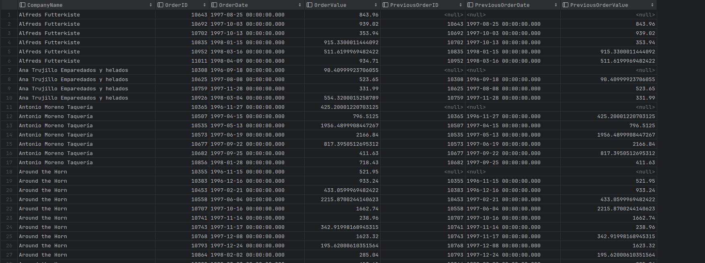

# SQL - Funkcje okna (Window functions)

# Lab 1-2-3

---

**Imię i nazwisko:** Bartłomiej Chwast, Jakub Domogała

---

Celem ćwiczenia jest zapoznanie się z działaniem funkcji okna (window functions) w SQL, analiza wydajności zapytań i porównanie z rozwiązaniami przy wykorzystaniu "tradycyjnych" konstrukcji SQL

Swoje odpowiedzi wpisuj w miejsca oznaczone jako:

```sql
-- wyniki ...
```

Ważne/wymagane są komentarze.

Zamieść kod rozwiązania oraz zrzuty ekranu pokazujące wyniki, (dołącz kod rozwiązania w formie tekstowej/źródłowej)

Zwróć uwagę na formatowanie kodu

---

## Oprogramowanie - co jest potrzebne?

Do wykonania ćwiczenia potrzebne jest następujące oprogramowanie:

- MS SQL Server - wersja 2019, 2022
- PostgreSQL - wersja 15/16
- SQLite
- Narzędzia do komunikacji z bazą danych
  - SSMS - Microsoft SQL Managment Studio
  - DtataGrip lub DBeaver
- Przykładowa baza Northwind
  - W wersji dla każdego z wymienionych serwerów

Oprogramowanie dostępne jest na przygotowanej maszynie wirtualnej

## Dokumentacja/Literatura

- Kathi Kellenberger, Clayton Groom, Ed Pollack, Expert T-SQL Window Functions in SQL Server 2019, Apres 2019
- Itzik Ben-Gan, T-SQL Window Functions: For Data Analysis and Beyond, Microsoft 2020

- Kilka linków do materiałów które mogą być pomocne - https://learn.microsoft.com/en-us/sql/t-sql/queries/select-over-clause-transact-sql?view=sql-server-ver16

  - https://www.sqlservertutorial.net/sql-server-window-functions/
  - https://www.sqlshack.com/use-window-functions-sql-server/
  - https://www.postgresql.org/docs/current/tutorial-window.html
  - https://www.postgresqltutorial.com/postgresql-window-function/
  - https://www.sqlite.org/windowfunctions.html
  - https://www.sqlitetutorial.net/sqlite-window-functions/

- Ikonki używane w graficznej prezentacji planu zapytania w SSMS opisane są tutaj:
  - [https://docs.microsoft.com/en-us/sql/relational-databases/showplan-logical-and-physical-operators-reference](https://docs.microsoft.com/en-us/sql/relational-databases/showplan-logical-and-physical-operators-reference)

---

# Zadanie 1 - obserwacja

Wykonaj i porównaj wyniki następujących poleceń.

```sql
select avg(unitprice) avgprice
from products p;

select avg(unitprice) over () as avgprice
from products p;

select categoryid, avg(unitprice) avgprice
from products p
group by categoryid

select avg(unitprice) over (partition by categoryid) as avgprice
from products p;
```

Jaka jest są podobieństwa, jakie różnice pomiędzy grupowaniem danych a działaniem funkcji okna?


```
W wyniku pierwszego zapytania otrzymaliśmy jedną wartość - średnią cenę wszystkich produktów.
W wyniku drugiego zapytania otrzymaliśmy tyle samo wartości ile w tabeli, ale wszystkie są równe średniej cenie wszystkich produktów.
W wyniku trzeciego zapytania otrzymaliśmy średnią cenę produktów w każdej kategorii.
W wyniku czwartego zapytania otrzymaliśmy tyle samo wartości ile w tabeli, ale wszystkie są równe średniej cenie produktów w danej kategorii.

Zarówno funkcja okna jak i grupowanie danych pozwala na uzyskanie wyników dla grupy wierszy.
W przypadku grupowania wynik jest obliczany dla każdej grupy, a w przypadku funkcji okna wynik jest obliczany dla każdego wiersza w grupie.
```

---

# Zadanie 2 - obserwacja

Wykonaj i porównaj wyniki następujących poleceń.

```sql
--1)

select p.productid, p.ProductName, p.unitprice,
	(select avg(unitprice) from products) as avgprice
from products p
where productid < 10

--2)
select p.productid, p.ProductName, p.unitprice,
	 avg(unitprice) over () as avgprice
from products p
where productid < 10
```


Jaka jest różnica? Czego dotyczy warunek w każdym z przypadków? Napisz polecenie równoważne

- 1. z wykorzystaniem funkcji okna. Napisz polecenie równoważne
- 2. z wykorzystaniem podzapytania

```
W wyniku pierwszego zapytania otrzymaliśmy średnią cenę wszystkich produktów dla każdego produktu, który ma id mniejsze niż 10.
W wyniku drugiego zapytania otrzymaliśmy średnią cenę produktów, które mają id mniejze niż 10, dla każdego produktu, który ma id mniejsze niż 10.

W pierwszym zapytaniu warunek nie dotyczył podzapytania, a w drugim zapytaniu warunek dotyczył funkcji okna.
```

```sql
-- Polecenie równoważne 1) z wykorzystaniem funkcji okna:
with av as (
    select p.productid, p.ProductName, p.unitprice,
       avg(unitprice) over () as avgprice
    from products p
)
select * from av
where productid < 10

-- Polecenie równoważne 2) z wykorzystaniem podzapytania:
select p.productid, p.ProductName, p.unitprice,
	(select avg(unitprice) from products where productid < 10) as avgprice
from products p
where productid < 10
```


# Zadanie 3

Baza: Northwind, tabela: products

Napisz polecenie, które zwraca: id produktu, nazwę produktu, cenę produktu, średnią cenę wszystkich produktów.

Napisz polecenie z wykorzystaniem z wykorzystaniem podzapytania, join'a oraz funkcji okna. Porównaj czasy oraz plany wykonania zapytań.

Przetestuj działanie w różnych SZBD (MS SQL Server, PostgreSql, SQLite)

W SSMS włącz dwie opcje: Include Actual Execution Plan oraz Include Live Query Statistics


W DataGrip użyj opcji Explain Plan/Explain Analyze


```sql
-- podzapytanie
select p.productId, p.productName, p.unitPrice,
       (select avg(unitprice) from products) as avgPrice
from products p;

-- join
with av as (
    select p.productId,
        (select avg(unitprice) from products) as avgPrice
    from products p
)
select p.productId, p.productName, p.unitPrice,
         av.avgPrice
from products p
inner join av on p.productId = av.productId;

-- funkcja okna
select p.productId, p.productName, p.unitPrice,
       avg(unitprice) over () as avgPrice
from products p;
```


### MSSQL

Podzapytanie\

Join\

Funkcja okna\


```
W przypadku użycia funkcji okna, plan wykonania ma więcej kroków wykonywanych równolegle.
Plan wykonania z użyciem podzapytania wygląda na najprostszy, ale kroki wykonują się sekwencyjnie.
```

### SQLite

Podzapytanie\

Join\

Funkcja okna\


```
Dla SQLite'a wygenerowane plany wykonania są dużo mniej szczegółowo opisane niż dla pozostałych SZBD.
W przypadku joina plan wykonujemy równologle 3 kroki, jednakże ilość wykonanych akcji jest również większa.
W podzapytaniu i funkcji okna wykonywane są dwukrotnie pełne skany tabel, dla joina wykonujemy skany indeksowe.
```

### PostgreSQL

Podzapytanie\

Join\

Funkcja okna\


```
PostgreSQL ma najprostszy plan wykonania dla użycia funkcji okna.
Plan wykonania z użyciem joina jest najbardziej skomplikowany i wskazuje na trzykrotne wykonanie pełnego skanu tabeli.
```

```
Czasy wykonania dla każdego zapytania są zbliżone - około 100ms, nie jesteśmy w stanie stwierdzić, które zapytanie jest najszybsze,
ponieważ czasy wykonania są na tyle niskie, że czynnik zewnętrzne mogły mieć większy wpływ na wydajność.

Dla PostgreSQL możemy zaobserwować, że plan wykonania przy uzyciu funkcji okna jest najprostszy
i użycie takiej konstrukcji przyniosło najwięcej korzyści.
```

---

# Zadanie 4

Baza: Northwind, tabela products

Napisz polecenie, które zwraca: id produktu, nazwę produktu, cenę produktu, średnią cenę produktów w kategorii, do której należy dany produkt. Wyświetl tylko pozycje (produkty) których cena jest większa niż średnia cena.

Napisz polecenie z wykorzystaniem podzapytania, join'a oraz funkcji okna. Porównaj zapytania. Porównaj czasy oraz plany wykonania zapytań.

Przetestuj działanie w różnych SZBD (MS SQL Server, PostgreSql, SQLite)

```sql
-- podzapytanie
select p.productId, p.productName, p.unitPrice,
       (select avg(unitprice) from products where CategoryID = p.CategoryID) as avgPrice
from products p
where p.unitPrice > (select avg(unitprice) from products where CategoryID = p.CategoryID);

-- join
with av as (
    select p.categoryId, avg(unitprice) avgPrice
    from products p
    group by p.categoryId
)
select p.productId, p.productName, p.unitPrice, av.avgPrice
from products p
inner join av on p.CategoryID = av.CategoryID
where p.unitPrice > av.avgPrice;

-- funkcja okna
with av as (
    select p.productId, p.productName, p.unitPrice,
           avg(unitprice) over (partition by CategoryID) as avgPrice
    from products p
)
select * from av
where unitPrice > avgPrice;
```


### MSSQL

Podzapytanie\

Join\

Funkcja okna\


```
Dla podzapytania plan wykonania wygląda na najbardziej skomplikowany, jeden raz więcej wykonywane są zagnieżdżone pętle
oraz pęłny indx scan, w każdym z trzech przypadków możemy zaobserwować zrównoleglenie wykoniania poszczególnych kroków.
```

### SQLite

Podzapytanie\

Join\

Funkcja okna\


```
Dla podzapytania i joina możemy mówić o dość podobnym planie wykonania, z widocznym wykonaniem podzapytań w pierwszym przypadku.
Dla funkcji okna mamy dłuższy łańcuch wykonywanych kroków, z dwoma pełnymi skanami a jednym indeksowym.
```

### PostgreSQL

Podzapytanie\

Join\

Funkcja okna\


```
Ponownie, korzystając z PostgreSQL otrzymaliśmy najprostszy plan wykonania dla funkcji okna, dla podzapytania i joina
wykonywane były dodatkowe pełne skany tabeli (łącznie trzy dla podzapytania i dwa dla joina)
```

```
Łatwo zauważyć, że plany wykonania w MSSQL są zdecydowanie najbardziej skomplikowane, z dużą ilością wykonywanych kroków.
Pod względem czasów wykonania, ponownie nie jesteśmy w stanie wykonać sensownego porównania, poprzez zbyt małą ilość danych w tabeli.
W MSSQL i PostgreSQL zapytania ponownie trwały około 100ms, w SQLite średnio mniej - 60ms
```

---

# Zadanie 5 - przygotowanie

Baza: Northwind

Tabela products zawiera tylko 77 wiersz. Warto zaobserwować działanie na większym zbiorze danych.

Wygeneruj tabelę zawierającą kilka milionów (kilkaset tys.) wierszy

Stwórz tabelę o następującej strukturze:

Skrypt dla SQL Srerver

```sql
create table product_history(
		 id int identity(1,1) not null,
		 productid int,
		 productname varchar(40) not null,
		 supplierid int null,
		 categoryid int null,
		 quantityperunit varchar(20) null,
		 unitprice decimal(10,2) null,
		 quantity int,
		 value decimal(10,2),
		 date date,
	constraint pk_product_history primary key clustered
			 (id asc )
)
```

Wygeneruj przykładowe dane:

Dla 30000 iteracji, tabela będzie zawierała nieco ponad 2mln wierszy (dostostu ograniczenie do możliwości swojego komputera)

Skrypt dla SQL Srerver

```sql
declare @i int
set @i = 1
while @i <= 30000
begin
    insert product_history
    select productid, ProductName, SupplierID, CategoryID,
         QuantityPerUnit,round(RAND()*unitprice + 10,2),
         cast(RAND() * productid + 10 as int), 0,
         dateadd(day, @i, '1940-01-01')
    from products
    set @i = @i + 1;
end;

update product_history
set value = unitprice * quantity
where 1=1;
```

Skrypt dla Postgresql

```sql
create table product_history(
		 id int generated always as identity not null
						 constraint pkproduct_history
											 primary key,
		 productid int,
		 productname varchar(40) not null,
		 supplierid int null,
		 categoryid int null,
		 quantityperunit varchar(20) null,
		 unitprice decimal(10,2) null,
		 quantity int,
		 value decimal(10,2),
		 date date
);
```

Wygeneruj przykładowe dane:

Skrypt dla Postgresql

```sql
do $$
begin
  for cnt in 1..30000 loop
    insert into product_history(productid, productname, supplierid,
           categoryid, quantityperunit,
           unitprice, quantity, value, date)
    select productid, productname, supplierid, categoryid,
           quantityperunit,
           round((random()*unitprice + 10)::numeric,2),
           cast(random() * productid + 10 as int), 0,
           cast('1940-01-01' as date) + cnt
    from products;
  end loop;
end; $$;

update product_history
set value = unitprice * quantity
where 1=1;
```

Wykonaj polecenia: `select count(*) from product_history`, potwierdzające wykonanie zadania

MSSQL\
\
Postgresql\
\
SQLite\


---

# Zadanie 6

Baza: Northwind, tabela product_history

To samo co w zadaniu 3, ale dla większego zbioru danych

Napisz polecenie, które zwraca: id pozycji, id produktu, nazwę produktu, cenę produktu, średnią cenę produktów w kategorii do której należy dany produkt. Wyświetl tylko pozycje (produkty) których cena jest większa niż średnia cena.

Napisz polecenie z wykorzystaniem podzapytania, join'a oraz funkcji okna. Porównaj zapytania. Porównaj czasy oraz plany wykonania zapytań.

Przetestuj działanie w różnych SZBD (MS SQL Server, PostgreSql, SQLite)

```sql
-- podzapytanie
select p.id, p.productId, p.productName, p.unitPrice,
       (select avg(unitprice) from product_history where CategoryID = p.CategoryID) as avgPrice
from product_history p
where p.unitPrice > (select avg(unitprice) from product_history where CategoryID = p.CategoryID);

-- join
with av as (
    select p.categoryId, avg(unitprice) avgPrice
    from product_history p
    group by p.categoryId
)
select p.id, p.productId, p.productName, p.unitPrice, av.avgPrice
from product_history p
inner join av on p.CategoryID = av.CategoryID
where p.unitPrice > av.avgPrice;

-- funkcja okna
with av as (
    select p.id, p.productId, p.productName, p.unitPrice,
           avg(unitprice) over (partition by CategoryID) as avgPrice
    from product_history p
)
select * from av
where unitPrice > avgPrice;
```


### MSSQL

Podzapytanie\

Join\

Funkcja okna\


```
Plany wykonania wyglądają podobnie jak w zadaniu 4-tym. Kolejno dla podzapytania, joina i funkcji okna wykonuje się
coraz mniej kroków, a plan wykonania jest coraz prostszy. Ilość full index scanów maleje od 3 do 1.
```

### SQLite

Podzapytanie\

Join\

Funkcja okna\


```
Plany wykonania wyglądają podobnie jak w zadaniu 4-tym. Ponownie widoczne wskazania na podzapytania w pierwszym przypadku
```

### PostgreSQL

Podzapytanie\

Join\

Funkcja okna\


```
Plany wykonania wyglądają podobnie jak w zadaniu 4-tym. Łatwo zauważyć wykonanie dwóch pełnych skanów dla joina a jednego dla funkcji okna.
Plan wykonania dla podzapytania wygląda na najprostszy, jednakże możemy zauważyć ogromne koszty w agregacjach, co z pewnością
wpłynęło na czas wykonania.
```

```
MSSQL
Podzapytanie - wyniki przyrostowe (100 wierszy co ok. 500 milisekund)
Join - wyniki przyrostowe (100 wierszy co ok. 800 milisekund)
Funkcja okna - wyniki przyrostowe (100 wierszy co ok. 950 milisekund)

SQLite
Podzapytanie - wyniki przyrostowe (100 wierszy co ok. 20 sekund)
Join - wyniki przyrostowe (100 wierszy co ok. 120 milisekund)
Funkcja okna - wyniki przyrostowe (100 wierszy co ok. 160 milisekund)

PostgreSQL
Podzapytanie - za długo aby ocenić
Join - wyniki przyrostowe (100 wierszy co ok. 160 milisekund)
Funkcja okna - wyniki przyrostowe (100 wierszy co ok. 400 milisekund)

MSSQL jest w stanie zoptymalizować zapytanie z użyciem podzapytania, w pozostałych SZBD zauważalna przewaga joina i funkcji okna.
```

---

# Zadanie 7

Baza: Northwind, tabela product_history

Lekka modyfikacja poprzedniego zadania

Napisz polecenie, które zwraca: id pozycji, id produktu, nazwę produktu, cenę produktu oraz

- średnią cenę produktów w kategorii do której należy dany produkt.
- łączną wartość sprzedaży produktów danej kategorii (suma dla pola value)
- średnią cenę danego produktu w roku którego dotyczy dana pozycja
- łączną wartość sprzedaży produktów danej kategorii (suma dla pola value)

Napisz polecenie z wykorzystaniem podzapytania, join'a oraz funkcji okna. Porównaj zapytania. W przypadku funkcji okna spróbuj użyć klauzuli WINDOW.

Porównaj czasy oraz plany wykonania zapytań.

Przetestuj działanie w różnych SZBD (MS SQL Server, PostgreSql, SQLite)

### MSSQL

```sql
-- podzapytanie
select p.id, p.productId, p.productName, p.unitPrice,
    (select avg(unitprice) from product_history where categoryId = p.categoryId) as avgCatPrice,
    (select sum(value) from product_history where categoryid = p.categoryId) as totalValue,
    (select avg(unitprice) from product_history where productId = p.productId and year(date) = year(p.date)) as avgYearPrice
from product_history p;

-- join
with av1 as (select p.categoryId, avg(unitprice) avgCatPrice, sum(value) totalValue
             from product_history p
             group by p.categoryId
),
av2 as (
    select p.productId, year(p.date) year, avg(unitprice) avgYearPrice
    from product_history p
    group by p.productId, year(p.date)
)
select p.id, p.productId, p.productName, p.unitPrice, av1.avgCatPrice, av1.totalValue, av2.avgYearPrice
from product_history p
inner join av1 on p.CategoryID = av1.CategoryID
inner join av2 on p.productId = av2.productId and year(p.date) = av2.year;

-- funkcja okna
select p.id, p.productId, p.productName, p.unitPrice,
    avg(unitprice) over w as avgCatPrice,
    sum(value) over w as totalValue,
    avg(unitprice) over (partition by p.productId, year(p.date)) as avgYearPrice
from product_history p
window w as (partition by p.categoryId);
```

Podzapytanie\

Join\

Funkcja okna\


```
Dla joina widzimy zrównoleglone kroki z łącznie trzema pełnymi skanami tabeli. W przypadku funkcji okna wszystkie kroki
wykonują się sekwencyjnie i potrzebny jest tylko jeden pełny skan.
Dla podzapytania widoczne cztery pełne skany i zagnieżdżone pętle, co z pewnością miało wpływ na czas wykonania.
```

### SQLite

```sql
-- podzapytanie
select p.id, p.productId, p.productName, p.unitPrice,
    (select avg(unitprice) from product_history where categoryId = p.categoryId) as avgCatPrice,
    (select sum(value) from product_history where categoryid = p.categoryId) as totalValue,
    (select avg(unitprice) from product_history where productId = p.productId and strftime('%Y', date) = strftime('%Y', p.date)) as avgYearPrice
from product_history p;

-- join
with av1 as (select p.categoryId, avg(unitprice) avgCatPrice, sum(value) totalValue
             from product_history p
             group by p.categoryId
),
av2 as (
    select p.productId, strftime('%Y', p.date) year, avg(unitprice) avgYearPrice
    from product_history p
    group by p.productId, strftime('%Y', p.date)
)
select p.id, p.productId, p.productName, p.unitPrice, av1.avgCatPrice, av1.totalValue, av2.avgYearPrice
from product_history p
inner join av1 on p.CategoryID = av1.CategoryID
inner join av2 on p.productId = av2.productId and strftime('%Y', p.date) = av2.year;

-- funkcja okna
select p.id, p.productId, p.productName, p.unitPrice,
    avg(unitprice) over w as avgCatPrice,
    sum(value) over w as totalValue,
    avg(unitprice) over (partition by p.productId, strftime('%Y', p.date)) as avgYearPrice
from product_history p
window w as (partition by p.categoryId);
```

Podzapytanie\

Join\

Funkcja okna\


```
W podzapytaniu mamy widoczne wywołania podzapytań, w przypadku joina widzimy dużo równoległych kroków, a dla funkcji okna
plan jest wizualnie czymś pomiędzy podzapytaniem a joinem. Z powodu ubogiego opisu ciężko wywnioskować wiele z tych planów.
```

### PostgreSQL

```sql
-- podzapytanie
select p.id, p.productId, p.productName, p.unitPrice,
    (select avg(unitprice) from product_history where categoryId = p.categoryId) as avgCatPrice,
    (select sum(value) from product_history where categoryid = p.categoryId) as totalValue,
    (select avg(unitprice) from product_history where productId = p.productId and extract('Year' from date) = extract('Year' from p.date)) as avgYearPrice
from product_history p;

-- join
with av1 as (select p.categoryId, avg(unitprice) as avgCatPrice, sum(value) totalValue
             from product_history p
             group by p.categoryId
),
av2 as (
    select p.productId, extract('Year' from p.date) as year, avg(unitprice) avgYearPrice
    from product_history p
    group by p.productId, extract('Year' from p.date)
)
select p.id, p.productId, p.productName, p.unitPrice, av1.avgCatPrice, av1.totalValue, av2.avgYearPrice
from product_history p
inner join av1 on p.CategoryID = av1.CategoryID
inner join av2 on p.productId = av2.productId and extract('Year' from p.date) = av2.year;

-- funkcja okna
select p.id, p.productId, p.productName, p.unitPrice,
    avg(unitprice) over w as avgCatPrice,
    sum(value) over w as totalValue,
    avg(unitprice) over (partition by p.productId, extract('Year' from p.date)) as avgYearPrice
from product_history p
window w as (partition by p.categoryId);
```

Podzapytanie\

Join\

Funkcja okna\


```
Dla joina widzimy zrównoleglone kroki z łącznie trzema pełnymi skanami tabeli. W przypadku funkcji okna wszystkie kroki
wykonują się sekwencyjnie i potrzebny jest tylko jeden pełny skan.
Dla podzapytanbia łącznie cztery pełne skany i bardzo kosztowne agregacje.
Charakterystyka planów bardzo podobna do tych z MSSQL.
```


```
MSSQL
Podzapytanie - za długo aby ocenić
Join - wyniki przyrostowe (100 wierszy co ok. 3 sekundy)
Funkcja okna - podobny rezultat jak dla joina

SQLite
Podzapytanie - za długo aby ocenić
Join - wyniki przyrostowe (100 wierszy co ok. 800 milisekund)
Funkcja okna - wyniki przyrostowe (100 wierszy co ok. 650 milisekund)

PostgreSQL
Podzapytanie - za długo aby ocenić
Join - wyniki przyrostowe (100 wierszy co ok. 300 milisekund)
Funkcja okna - wyniki przyrostowe (100 wierszy co ok. 800 milisekund)
```

---

# Zadanie 8 - obserwacja

Funkcje rankingu, `row_number()`, `rank()`, `dense_rank()`

Wykonaj polecenie, zaobserwuj wynik. Porównaj funkcje row_number(), rank(), dense_rank()

```sql
select productid, productname, unitprice, categoryid,
    row_number() over(partition by categoryid order by unitprice desc) as rowno,
    rank() over(partition by categoryid order by unitprice desc) as rankprice,
    dense_rank() over(partition by categoryid order by unitprice desc) as denserankprice
from products;
```


```
row_number() - unikalny numer dla kazdego w partycji
rank() - te same rangi dla powiązanych i odpowiednio przeskakuje rangi przy tym
dense_rank() - te same rangi dla powiązanych i odpowiednio nie przeskakuje rangi przy tym
```

Zadanie

Spróbuj uzyskać ten sam wynik bez użycia funkcji okna

```sql
select p.productid, p.productname, p.unitprice, p.categoryid,
    (select count(*) from products
        where p.categoryId = CategoryID
        and (p.UnitPrice < UnitPrice or (p.UnitPrice = UnitPrice and p.ProductID > ProductID))) + 1 as rowno,
    (select count(*) from products
        where p.categoryId = CategoryID
        and p.UnitPrice < UnitPrice) + 1 as rankprice,
    (select count(distinct UnitPrice) from products
        where p.categoryId = CategoryID and p.UnitPrice < UnitPrice) + 1 as denserankprice
from products p
order by p.CategoryID, p.UnitPrice desc;
```

---

# Zadanie 9

Baza: Northwind, tabela product_history

Dla każdego produktu, podaj 4 najwyższe ceny tego produktu w danym roku. Zbiór wynikowy powinien zawierać:

- rok
- id produktu
- nazwę produktu
- cenę
- datę (datę uzyskania przez produkt takiej ceny)
- pozycję w rankingu

Uporządkuj wynik wg roku, nr produktu, pozycji w rankingu

Spróbuj uzyskać ten sam wynik bez użycia funkcji okna, porównaj wyniki, czasy i plany zapytań. Przetestuj działanie w różnych SZBD (MS SQL Server, PostgreSql, SQLite)

### MSSQL

```sql
--- funkcja okna
with r as (
    select year(date) as year, productid, productname, unitprice, date,
        rank() over (partition by productid, year(date) order by unitprice desc) as rankprice
    from product_history
)
select * from r
where rankprice <= 4
order by year, productid, rankprice;

--- podzapytanie
with r as (
    select year(p.date) as year, p.productid, p.productname, p.unitprice, p.date,
        (select count(*) from product_history
            where year(date) = year(p.date)
                and productid = p.productid
                and (unitprice > p.unitprice)) + 1 as rankprice
from product_history p
)
select * from r
where rankprice <= 4
order by year, productid, rankprice;
```

Funkcja okna\

Podzapytanie\


```
Sekwencyjny plan wykonania dla funkcji okna, dla podzapytania zagnieżdżone pętle i dodatkowy skan tabeli
funkcja okna - wyniki przyrostowe (500 wierszy 450 milisekund)
podzapytanie - za długo
```

### SQLite

```sql
--- funkcja okna
with r as (
    select strftime('%Y', date) as year, productid, productname, unitprice, date,
        rank() over (partition by productid, strftime('%Y', date) order by unitprice desc) as rankprice
    from product_history
)
select * from r
where rankprice <= 4
order by year, productid, rankprice;

--- podzapytanie
with r as (
    select strftime('%Y', p.date) as year, p.productid, p.productname, p.unitprice, p.date,
        (select count(*) from product_history
            where strftime('%Y', date) = strftime('%Y', p.date)
                and productid = p.productid
                and (unitprice > p.unitprice)) + 1 as rankprice
from product_history p
)
select * from r
where rankprice <= 4
order by year, productid, rankprice;
```

Funkcja okna\

Podzapytanie\


```
Widoczne wykonania podzapytań dla planu z podzapytaniem, ciężko coś sensownego wywnioskować.
funkcja okna - wyniki przyrostowe (500 wierszy 1870 milisekund)
podzapytanie - za długo
```

### PostgreSQL

```sql
--- funkcja okna
with r as (
    select extract('Year' from date) as year, productid, productname, unitprice, date,
        rank() over (partition by productid, extract('Year' from date) order by unitprice desc) as rankprice
    from product_history
)
select * from r
where rankprice <= 4
order by year, productid, rankprice;

--- podzapytanie
with r as (
    select extract('Year' from p.date) as year, p.productid, p.productname, p.unitprice, p.date,
        (select count(*) from product_history
            where extract('Year' from date) = extract('Year' from p.date)
                and productid = p.productid
                and (unitprice > p.unitprice)) + 1 as rankprice
from product_history p
)
select * from r
where rankprice <= 4
order by year, productid, rankprice;
```

Funkcja okna\

Podzapytanie\


```
Dla funkcji okna sekwencyjny plan wykonania, dla podzapytania kosztowne agregacje.
funkcja okna - wyniki przyrostowe (500 wierszy 9 sekund)
podzapytanie - za długo
```

```
Miażdżaca przewaga funkcji okna nad podzapytaniem, dla każdego z trzech SZBD
```

---

# Zadanie 10 - obserwacja

Funkcje `lag()`, `lead()`

Wykonaj polecenia, zaobserwuj wynik. Jak działają funkcje `lag()`, `lead()`

```sql
select productid, productname, categoryid, date, unitprice,
       lag(unitprice) over (partition by productid order by date)
as previousprodprice,
       lead(unitprice) over (partition by productid order by date)
as nextprodprice
from product_history
where productid = 1 and year(date) = 2022
order by date;

with t as (select productid, productname, categoryid, date, unitprice,
                  lag(unitprice) over (partition by productid
order by date) as previousprodprice,
                  lead(unitprice) over (partition by productid
order by date) as nextprodprice
           from product_history
           )
select * from t
where productid = 1 and year(date) = 2022
order by date;
```


```
Drugie zapytanie działa podaje wartość poprzednią dla pierwszego rekordu, jednak jego wykonanie zajmuje dwa razy więcej czasu
1. 140 milisekund
2. 290 milisekund
```

Zadanie

Spróbuj uzyskać ten sam wynik bez użycia funkcji okna, porównaj wyniki, czasy i plany zapytań. Przetestuj działanie w różnych SZBD (MS SQL Server, PostgreSql, SQLite)

```sql
select p.productid, p.productname, p.categoryid, p.date, p.unitprice,
   (select unitprice from product_history
        where productid = p.productid and date = dateadd(day, -1, p.date)) as previousprodprice,
   (select unitprice from product_history
        where productid = p.productid and date = dateadd(day, 1, p.date)) as nextprodprice
from product_history p
where productid = 1 and year(date) = 2022
order by date;
```

```
lag() - wyciąga poprzednią wartość
lead() - wyciąga następną wartość

bez uzycia funkcji okna wykonanie trwa kilkadziesiąt razy dłuzej

Plany

MSSQL
z over
```


```
bez over
```


```
Dla funkcji okna mamy dłuuugą serie sekwencyjnych polecień,
odwrotnie dla funkcji nie uzywajacej okna, w tym przypadku mamy więcej równoległych działań, jednak nie przekłada się to na lepszy czas

Porównajmy jeszcze plany wykonania funkcji bez okna dla wszystkich trzech SZBD
```

```
MSSQL
```


```
SQLite
```

```sql
select p.productid, p.productname, p.categoryid, p.date, p.unitprice,
   (select unitprice from product_history
        where productid = p.productid and date = date(p.date, '-1 day')) as previousprodprice,
   (select unitprice from product_history
        where productid = p.productid and date = date(p.date, '+1 day')) as nextprodprice
from product_history p
where productid = 1 and strftime('%Y', date) = 2022
order by date;
```


```
PostgreSQL
```

```sql
select p.productid, p.productname, p.categoryid, p.date, p.unitprice,
   (select unitprice from product_history
        where productid = p.productid and date = p.date - interval '1 day') as previousprodprice,
   (select unitprice from product_history
        where productid = p.productid and date = p.date + interval '1 day') as nextprodprice
from product_history p
where productid = 1 and extract('Year' from date) = 2022
order by date;
```


```
Plan dla MSSQL jest duzo bardziej złozony względem pozostałych planów

Tak samo jak w poprzednich zadaniach widać zdecydowaną przewagę wydajności funkcji okna
```

---

# Zadanie 11

Baza: Northwind, tabele customers, orders, order details

Napisz polecenie które wyświetla inf. o zamówieniach

Zbiór wynikowy powinien zawierać:

- nazwę klienta, nr zamówienia,
- datę zamówienia,
- wartość zamówienia (wraz z opłatą za przesyłkę),
- nr poprzedniego zamówienia danego klienta,
- datę poprzedniego zamówienia danego klienta,
- wartość poprzedniego zamówienia danego klienta.

```sql
select c.CompanyName, o.OrderID, o.OrderDate, sum(od.Quantity * od.UnitPrice * (1 - od.Discount)) + o.Freight as OrderValue,
    lag(o.OrderID) over (partition by c.CompanyName order by o.OrderDate) as PreviousOrderID,
    lag(o.OrderDate) over (partition by c.CompanyName order by o.OrderDate) as PreviousOrderDate,
    lag(sum(od.Quantity * od.UnitPrice * (1 - od.Discount)) + o.Freight) over (partition by c.CompanyName order by o.OrderDate) as PreviousOrderValue
from orders o
inner join [Order Details] od on o.OrderID = od.OrderID
inner join Customers c on o.CustomerID = c.CustomerID
group by c.CompanyName, o.OrderID, o.OrderDate, o.Freight
```



---

# Zadanie 12 - obserwacja

Funkcje `first_value()`, `last_value()`

Wykonaj polecenia, zaobserwuj wynik. Jak działają funkcje `first_value()`, `last_value()`. Skomentuj uzyskane wyniki. Czy funkcja `first_value` pokazuje w tym przypadku najdroższy produkt w danej kategorii, czy funkcja `last_value()` pokazuje najtańszy produkt? Co jest przyczyną takiego działania funkcji `last_value`. Co trzeba zmienić żeby funkcja last_value pokazywała najtańszy produkt w danej kategorii

```sql
select productid, productname, unitprice, categoryid,
    first_value(productname) over (partition by categoryid
order by unitprice desc) first,
    last_value(productname) over (partition by categoryid
order by unitprice desc) last
from products
order by categoryid, unitprice desc;
```


```sql
select productid, productname, unitprice, categoryid,
    first_value(productname) over (partition by categoryid
order by unitprice desc) first,
    last_value(productname) over (partition by categoryid
order by unitprice desc RANGE BETWEEN UNBOUNDED PRECEDING AND UNBOUNDED FOLLOWING ) last
from products
order by categoryid, unitprice desc;
```

```
W pierwszym przypadku funkcja last_value daje najmniejszy wynik w zakresie od początku do aktualnego wiersza, co jest standardowym
zachowaniem tej funkcji, aby dostać wartość globalną należy dodać warunek RANGE BETWEEN UNBOUNDED PRECEDING AND UNBOUNDED FOLLOWING
```


Zadanie

Spróbuj uzyskać ten sam wynik bez użycia funkcji okna, porównaj wyniki, czasy i plany zapytań. Przetestuj działanie w różnych SZBD (MS SQL Server, PostgreSql, SQLite)

### MSSQL

```sql
select p.productid, p.productname, p.unitprice, p.categoryid,
    (select top 1 productname from Products where p.CategoryID = CategoryID order by UnitPrice desc) as first,
    (select top 1 productname from Products where p.CategoryID = CategoryID order by UnitPrice) as last
from products p
order by p.categoryid, p.unitprice desc;
```

```
funkcja okna - 100 milisekund
```


```
podzapytanie - 100 milisekund
```


### SQLite / PostgreSQL

```sql
select p.productid, p.productname, p.unitprice, p.categoryid,
    (select productname from Products where p.CategoryID = CategoryID order by UnitPrice desc limit 1) as first,
    (select productname from Products where p.CategoryID = CategoryID order by UnitPrice limit 1) as last
from products p
order by p.categoryid, p.unitprice desc;
```

```
W przypadku tak małego zapytania cięzko zobaczyć róznicę w czasie

Dla SQLite i Postgre wyniki wynosiły po 50 milisekund jednak prawdopodobnie jest to spowodowane jedynie zdalnym połączeniem z MSSQL vs lokalnym połączeniem dla SQLite vs Postgre
```

---

# Zadanie 13

Baza: Northwind, tabele orders, order details

Napisz polecenie które wyświetla inf. o zamówieniach

Zbiór wynikowy powinien zawierać:

- Id klienta,
- nr zamówienia,
- datę zamówienia,
- wartość zamówienia (wraz z opłatą za przesyłkę),
- dane zamówienia klienta o najniższej wartości w danym miesiącu
  - nr zamówienia o najniższej wartości w danym miesiącu
  - datę tego zamówienia
  - wartość tego zamówienia
- dane zamówienia klienta o najwyższej wartości w danym miesiącu
  - nr zamówienia o najniższej wartości w danym miesiącu
  - datę tego zamówienia
  - wartość tego zamówienia

```sql
with r as (
    select c.CustomerID, o.OrderID, o.OrderDate, sum(od.Quantity * od.UnitPrice * (1 - od.Discount)) + o.Freight as OrderValue
    from orders o
    inner join [Order Details] od on o.OrderID = od.OrderID
    inner join Customers c on o.CustomerID = c.CustomerID
    group by c.CustomerID, o.OrderID, o.OrderDate, o.Freight
)
select *,
    first_value(concat(r.OrderID, ' ', r.OrderDate, ' ', r.OrderValue)) over (partition by r.CustomerID, month(r.OrderDate) order by r.OrderValue) as MinOrder,
    last_value(concat(r.OrderID, ' ', r.OrderDate, ' ', r.OrderValue)) over (partition by r.CustomerID, month(r.OrderDate) order by r.OrderValue range between unbounded preceding and unbounded following ) as MaxOrder
from r
```


---

# Zadanie 14

Baza: Northwind, tabela product_history

Napisz polecenie które pokaże wartość sprzedaży każdego produktu narastająco od początku każdego miesiąca. Użyj funkcji okna

Zbiór wynikowy powinien zawierać:

- id pozycji
- id produktu
- datę
- wartość sprzedaży produktu w danym dniu
- wartość sprzedaży produktu narastające od początku miesiąca

### MSSQL

```sql
select ph.id, ph.productid, ph.date, ph.value,
    sum(ph.value) over (partition by ph.productid, year(ph.date), month(ph.date) order by ph.date) as running_total
from product_history ph
order by ph.productid, ph.date;
```

### SQLite

```sql
SELECT
    ph.id,
    ph.productid,
    ph.date,
    ph.value,
    SUM(ph.value) OVER (PARTITION BY ph.productid, strftime('%Y', ph.date), strftime('%m', ph.date) ORDER BY ph.date) AS running_total
FROM
    product_history ph
ORDER BY
    ph.productid,
    ph.date;
```

### PostgreSQL

```sql
SELECT
    ph.id,
    ph.productid,
    ph.date,
    ph.value,
    SUM(ph.value) OVER (PARTITION BY ph.productid, EXTRACT(YEAR FROM ph.date), EXTRACT(MONTH FROM ph.date) ORDER BY ph.date) AS running_total
FROM
    product_history ph
ORDER BY
    ph.productid,
    ph.date;
```


Spróbuj wykonać zadanie bez użycia funkcji okna. Spróbuj uzyskać ten sam wynik bez użycia funkcji okna, porównaj wyniki, czasy i plany zapytań. Przetestuj działanie w różnych SZBD (MS SQL Server, PostgreSql, SQLite)

### MSSQL

```sql
select ph.id, ph.productid, ph.date, ph.value,
    (select sum(ph2.value) from product_history ph2
        where ph2.productid = ph.productid
            and year(ph2.date) = year(ph.date)
            and month(ph2.date) = month(ph.date)) as running_total
from product_history ph
order by ph.productid, ph.date;
```

### SQLite

```sql
SELECT
    ph.id,
    ph.productid,
    ph.date,
    ph.value,
    (SELECT SUM(ph2.value)
     FROM product_history ph2
     WHERE ph2.productid = ph.productid
       AND strftime('%Y', ph2.date) = strftime('%Y', ph.date)
       AND strftime('%m', ph2.date) = strftime('%m', ph.date)
    ) AS running_total
FROM
    product_history ph
ORDER BY
    ph.productid,
    ph.date;
```

### PostgreSQL

```sql
SELECT
    ph.id,
    ph.productid,
    ph.date,
    ph.value,
    (SELECT SUM(ph2.value)
     FROM product_history ph2
     WHERE ph2.productid = ph.productid
       AND EXTRACT(YEAR FROM ph2.date) = EXTRACT(YEAR FROM ph.date)
       AND EXTRACT(MONTH FROM ph2.date) = EXTRACT(MONTH FROM ph.date)
    ) AS running_total
FROM
    product_history ph
ORDER BY
    ph.productid,
    ph.date;
```

```
Czasy wykonania - dla funkcji okna
MSSQL - wyniki przyrostowe (500 wierszy w 19 sekund)
SQLite - wyniki przyrostowe (500 wierszy w 4 sekund)
PostgreSQL - wyniki przyrostowe (500 wierszy w 10 sekund)

Dla podzapytań bez funkcji okna nie doczekaliśmy momentu w którym zobaczyliśmy wyniki
```

```
Plany zapytań dla funkcji okna

MSSQL
```


```
SQLite
```


```
Postgre
```


```
Poziom skomplikowania planów wydaje się adekwatny do uzyskanych czasów.
```

---

# Zadanie 15

Wykonaj kilka "własnych" przykładowych analiz. Czy są jeszcze jakieś ciekawe/przydatne funkcje okna (z których nie korzystałeś w ćwiczeniu)? Spróbuj ich użyć w zaprezentowanych przykładach.

```sql
-- wyniki ...
```

Punktacja

|         |     |
| ------- | --- |
| zadanie | pkt |
| 1       | 0,5 |
| 2       | 0,5 |
| 3       | 1   |
| 4       | 1   |
| 5       | 0,5 |
| 6       | 2   |
| 7       | 2   |
| 8       | 0,5 |
| 9       | 2   |
| 10      | 1   |
| 11      | 2   |
| 12      | 1   |
| 13      | 2   |
| 14      | 2   |
| 15      | 2   |
| razem   | 20  |
