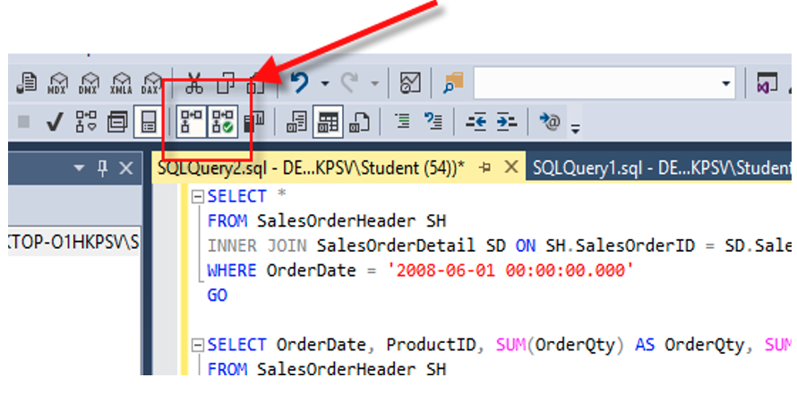
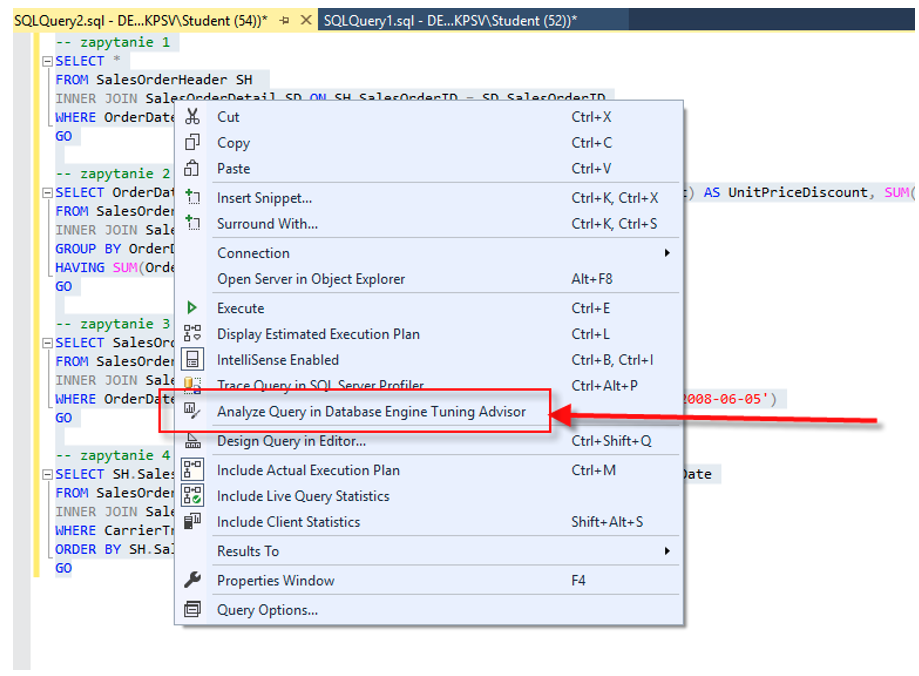

# Indeksy,  optymalizator <br>Lab 4

<!-- <style scoped>
 p,li {
    font-size: 12pt;
  }
</style>  -->

<!-- <style scoped>
 pre {
    font-size: 8pt;
  }
</style>  -->


---

**Imię i nazwisko: Bartłomiej Chwast, Jakub Domogała**

--- 

Celem ćwiczenia jest zapoznanie się z planami wykonania zapytań (execution plans), oraz z budową i możliwością wykorzystaniem indeksów.

Swoje odpowiedzi wpisuj w miejsca oznaczone jako:

---
> Wyniki: 

```sql
--  ...
```

---

Ważne/wymagane są komentarze.

Zamieść kod rozwiązania oraz zrzuty ekranu pokazujące wyniki, (dołącz kod rozwiązania w formie tekstowej/źródłowej)

Zwróć uwagę na formatowanie kodu

## Oprogramowanie - co jest potrzebne?

Do wykonania ćwiczenia potrzebne jest następujące oprogramowanie
- MS SQL Server,
- SSMS - SQL Server Management Studio    
- przykładowa baza danych AdventureWorks2017.
    
Oprogramowanie dostępne jest na przygotowanej maszynie wirtualnej


## Przygotowanie  

Uruchom Microsoft SQL Managment Studio. 
    
Stwórz swoją bazę danych o nazwie XYZ. 

```sql
create database xyz  
go  
  
use xyz  
go
```

Wykonaj poniższy skrypt, aby przygotować dane:

```sql
select * into [salesorderheader]  
from [adventureworks2017].sales.[salesorderheader]  
go  
  
select * into [salesorderdetail]  
from [adventureworks2017].sales.[salesorderdetail]  
go
```

## Dokumentacja/Literatura

Celem tej części ćwiczenia jest zapoznanie się z planami wykonania zapytań (execution plans) oraz narzędziem do automatycznego generowania indeksów.

Przydatne materiały/dokumentacja. Proszę zapoznać się z dokumentacją:
- [https://docs.microsoft.com/en-us/sql/tools/dta/tutorial-database-engine-tuning-advisor](https://docs.microsoft.com/en-us/sql/tools/dta/tutorial-database-engine-tuning-advisor)
- [https://docs.microsoft.com/en-us/sql/relational-databases/performance/start-and-use-the-database-engine-tuning-advisor](https://docs.microsoft.com/en-us/sql/relational-databases/performance/start-and-use-the-database-engine-tuning-advisor)
- [https://www.simple-talk.com/sql/performance/index-selection-and-the-query-optimizer](https://www.simple-talk.com/sql/performance/index-selection-and-the-query-optimizer)

Ikonki używane w graficznej prezentacji planu zapytania opisane są tutaj:
- [https://docs.microsoft.com/en-us/sql/relational-databases/showplan-logical-and-physical-operators-reference](https://docs.microsoft.com/en-us/sql/relational-databases/showplan-logical-and-physical-operators-reference)


<div style="page-break-after: always;"></div>

# Zadanie 1 - Obserwacja

Wpisz do MSSQL Managment Studio (na razie nie wykonuj tych zapytań):

```sql
-- zapytanie 1  
select *  
from salesorderheader sh  
inner join salesorderdetail sd on sh.salesorderid = sd.salesorderid  
where orderdate = '2008-06-01 00:00:00.000'  
go  
  
-- zapytanie 2  
select orderdate, productid, sum(orderqty) as orderqty, 
       sum(unitpricediscount) as unitpricediscount, sum(linetotal)  
from salesorderheader sh  
inner join salesorderdetail sd on sh.salesorderid = sd.salesorderid  
group by orderdate, productid  
having sum(orderqty) >= 100  
go  
  
-- zapytanie 3  
select salesordernumber, purchaseordernumber, duedate, shipdate  
from salesorderheader sh  
inner join salesorderdetail sd on sh.salesorderid = sd.salesorderid  
where orderdate in ('2008-06-01','2008-06-02', '2008-06-03', '2008-06-04', '2008-06-05')  
go  
  
-- zapytanie 4  
select sh.salesorderid, salesordernumber, purchaseordernumber, duedate, shipdate  
from salesorderheader sh  
inner join salesorderdetail sd on sh.salesorderid = sd.salesorderid  
where carriertrackingnumber in ('ef67-4713-bd', '6c08-4c4c-b8')  
order by sh.salesorderid  
go
```


Włącz dwie opcje: **Include Actual Execution Plan** oraz **Include Live Query Statistics**:


<!-- ![[_img/index1-1.png | 500]] -->





Teraz wykonaj poszczególne zapytania (najlepiej każde analizuj oddzielnie). Co można o nich powiedzieć? Co sprawdzają? Jak można je zoptymalizować?  
(Hint: aby wykonać tylko fragment kodu SQL znajdującego się w edytorze, zaznacz go i naciśnij F5)

---
Wyniki: 

**Zapytanie 1**


Zapytanie sprawdza zamówienia z 1 czerwca 2008 roku. Zbiór wynikowy jest pusty.
Można je zoptymalizować dodając indeks na kolumnę `OrderDate` w tabeli `salesorderheader`.

**Zapytanie 2**


Zapytanie grupuje zamówienia po dacie i produktach, sumując ilość zamówionych produktów, rabat oraz łączną wartość zamówienia. 
Można je zoptymalizować dodając indeks na kolumny `OrderQty`, `ProductID`, `UnitPriceDiscount` i `LineTotal` w tabeli `salesorderdetail`.

**Zapytanie 3**


Zapytanie sprawdza zamówienia z 1-5 czerwca 2008 roku. Zbiór wynikowy jest pusty.
Można je zoptymalizować dodając indeks na kolumnę `OrderDate` w tabeli `salesorderheader`.

**Zapytanie 4**


Zapytanie sprawdza zamówienia z numerami przewozowymi `ef67-4713-bd` i `6c08-4c4c-b8`.
Można je zoptymalizować dodając indeks na kolumnę `CarrierTrackingNumber` w tabeli `salesorderdetail`.
Otrzymujemy zduplikowane wyniki - można uzyskać czytelniejsze wyniki dodając `DISTINCT` do zapytania.
---


<div style="page-break-after: always;"></div>

# Zadanie 2 - Optymalizacja

Zaznacz wszystkie zapytania, i uruchom je w **Database Engine Tuning Advisor**:

<!-- ![[_img/index1-12.png | 500]] -->




Sprawdź zakładkę **Tuning Options**, co tam można skonfigurować?

---


Można skonfigurować:
* Czas wykonywania się tuningu/dostrajania. Można wybrać dzień i czas zakończenia procesu.
* Fizyczne struktury dla indeksów - można wybrać, czy indeksy, indeksowane widoki, indeksy niezgrupowane. Możemy także 
zaznaczyć czy chcemy otrzymać w rekomendacji także indeksy filtrowane i mieć rekomendowane indeksy kolumnowe. Również
możemy poprosić o wykorzystanie tylko istniejących struktur dla analizy.
* Wybór strategii partycjonowania - możemy wybrać brak partycjonowania, pełne partycjonowanie lub wyrównane partyconowanie
* Wybór jakie fizyczne struktury chcemy zachować w bazie danych - do wyboru: żadne, wszystkie, tylko indeksy,
tylko indeksy klastrowane, tylko wyrównane partycjonowanie.

Dodatkowo mamy opcje zaawansowane:
* Wybór maksymalnej przestrzeni dla rekomendacji
* Możliwość uwzględnienia zdarzeń z bufora planów z wszystkich baz danych
* Wybór maksymalnej liczby kolumn na indeks
* Możliwość korzystania z bazy danych w trakcie analizy.

---


Użyj **Start Analysis**:

<!-- ![[_img/index1-3.png | 500]] -->


Zaobserwuj wyniki w **Recommendations**.

Przejdź do zakładki **Reports**. Sprawdź poszczególne raporty. Główną uwagę zwróć na koszty i ich poprawę:


<!-- ![[_img/index4-1.png | 500]] -->


Zapisz poszczególne rekomendacje:

---
```sql
SET ANSI_PADDING ON

CREATE NONCLUSTERED INDEX [_dta_index_salesorderdetail_6_917578307__K3_1] ON [dbo].[salesorderdetail]
(
	[CarrierTrackingNumber] ASC
)
INCLUDE([SalesOrderID]) WITH (SORT_IN_TEMPDB = OFF, DROP_EXISTING = OFF, ONLINE = OFF) ON [PRIMARY]


CREATE NONCLUSTERED INDEX [_dta_index_salesorderdetail_6_917578307__K1_K5_4_8_9] 
       ON [dbo].[salesorderdetail]
(
	[SalesOrderID] ASC,
	[ProductID] ASC
)
INCLUDE([OrderQty],[UnitPriceDiscount],[LineTotal]) 
       WITH (SORT_IN_TEMPDB = OFF, DROP_EXISTING = OFF, ONLINE = OFF) 
       ON [PRIMARY]


CREATE NONCLUSTERED INDEX [_dta_index_salesorderdetail_6_917578307__K1_2_3_4_5_6_7_8_9_10_11] 
       ON [dbo].[salesorderdetail]
(
	[SalesOrderID] ASC
)
INCLUDE([SalesOrderDetailID],[CarrierTrackingNumber],[OrderQty],[ProductID],[SpecialOfferID],
       [UnitPrice],[UnitPriceDiscount],[LineTotal],[rowguid],[ModifiedDate]) 
       WITH (SORT_IN_TEMPDB = OFF, DROP_EXISTING = OFF, ONLINE = OFF) ON [PRIMARY]


CREATE STATISTICS [_dta_stat_917578307_1_3] ON [dbo].[salesorderdetail]([SalesOrderID], 
       [CarrierTrackingNumber])
WITH AUTO_DROP = OFF


CREATE NONCLUSTERED INDEX [_dta_index_salesorderheader_6_901578250__K3_1] ON [dbo].[salesorderheader]
(
	[OrderDate] ASC
)
INCLUDE([SalesOrderID]) WITH (SORT_IN_TEMPDB = OFF, DROP_EXISTING = OFF, ONLINE = OFF) ON [PRIMARY]


CREATE NONCLUSTERED INDEX [_dta_index_salesorderheader_6_901578250__K1_4_5_8_9] 
       ON [dbo].[salesorderheader]
(
	[SalesOrderID] ASC
)
INCLUDE([DueDate],[ShipDate],[SalesOrderNumber],[PurchaseOrderNumber]) 
       WITH (SORT_IN_TEMPDB = OFF, DROP_EXISTING = OFF, ONLINE = OFF) ON [PRIMARY]


CREATE NONCLUSTERED INDEX 
       [_dta_index_salesorderheader_6_901578250__K3_K1_2_4_5_6_7_8_9_10_11_12_13_14_15_16_17_18_19_20
       _21_22_23_24_25_26] 
       ON [dbo].[salesorderheader]
(
	[OrderDate] ASC,
	[SalesOrderID] ASC
)
INCLUDE([RevisionNumber],[DueDate],[ShipDate],[Status],[OnlineOrderFlag],[SalesOrderNumber],
       [PurchaseOrderNumber],[AccountNumber],[CustomerID],[SalesPersonID],[TerritoryID],
       [BillToAddressID],[ShipToAddressID],[ShipMethodID],[CreditCardID],
       [CreditCardApprovalCode],[CurrencyRateID],[SubTotal],[TaxAmt],[Freight],[TotalDue],
       [Comment],[rowguid],[ModifiedDate]) 
       WITH (SORT_IN_TEMPDB = OFF, DROP_EXISTING = OFF, ONLINE = OFF) ON [PRIMARY]


CREATE STATISTICS [_dta_stat_901578250_1_3] ON [dbo].[salesorderheader]([SalesOrderID], [OrderDate])
WITH AUTO_DROP = OFF
```

Uruchom zapisany skrypt w Management Studio.

Opisz, dlaczego dane indeksy zostały zaproponowane do zapytań:

---

Takie indeksy zostały zaproponowane, ponieważ w wykonywach zapytaniach były wykorzystywane te kolumny w połączeniu 
ze sobą. Dodatkowo system zaproponował dodanie indeksów na kilka innych kolumn, które potencjalnie pomogłyby w 
optymalizacji podobnych zapytań.

---

Sprawdź jak zmieniły się Execution Plany. Opisz zmiany:

---

**Zapytanie 1**


Zamiast skanowania całych tabel, system wykorzystuje indeksy oraz nie wykonuje hash joina, a zamiast tego korzysta z nested loop joina.

**Zapytanie 2**


Ponownie zamiast skanować całe tabele, system korzysta z indeksów.

**Zapytanie 3**


Zmiany takie same jak przy pierwszym zapytaniu.

**Zapytanie 4**


Zmiany takie same jak przy pierwszym zapytaniu. Dodatkowo, system sortuje wyniki z `salesorderdetail` przed wykonaniem joina.

---


<div style="page-break-after: always;"></div>

# Zadanie 3 - Kontrola "zdrowia" indeksu

## Dokumentacja/Literatura

Celem kolejnego zadania jest zapoznanie się z możliwością administracji i kontroli indeksów.

Na temat wewnętrznej struktury indeksów można przeczytać tutaj:
- [https://technet.microsoft.com/en-us/library/2007.03.sqlindex.aspx](https://technet.microsoft.com/en-us/library/2007.03.sqlindex.aspx)
- [https://docs.microsoft.com/en-us/sql/relational-databases/system-dynamic-management-views/sys-dm-db-index-physical-stats-transact-sql](https://docs.microsoft.com/en-us/sql/relational-databases/system-dynamic-management-views/sys-dm-db-index-physical-stats-transact-sql)
- [https://docs.microsoft.com/en-us/sql/relational-databases/system-dynamic-management-views/sys-dm-db-index-physical-stats-transact-sql](https://docs.microsoft.com/en-us/sql/relational-databases/system-dynamic-management-views/sys-dm-db-index-physical-stats-transact-sql)
- [https://docs.microsoft.com/en-us/sql/relational-databases/system-catalog-views/sys-indexes-transact-sql](https://docs.microsoft.com/en-us/sql/relational-databases/system-catalog-views/sys-indexes-transact-sql)

Sprawdź jakie informacje można wyczytać ze statystyk indeksu:

```sql
select *  
from sys.dm_db_index_physical_stats (db_id('adventureworks2017')  
,object_id('humanresources.employee')  
,null -- null to view all indexes; otherwise, input index number  
,null -- null to view all partitions of an index  
,'detailed') -- we want all information
```

Jakie są według Ciebie najważniejsze pola?

---

Najważniejszymi polami wydają się być:
* `avg_fragmentation_in_percent` - procent fragmentacji indeksu (im mniejszy tym lepiej), wartości znacznie wyższe niż 0 
oznaczają, że indeks wymaga reorganizacji lub przebudowy, ponieważ zbyt dużo danych jest w niepoprawnej kolejności, 
co wpływa na wydajność zapytań. Dokumentacja mówi, że wartości do 10% są akceptowalne.
* `avg_page_space_used_in_percent` - procent wykorzystania strony indeksu (im większy tym lepiej), wartości zbyt niskie 
oznaczają, że indeks zajmuje zbyt dużo miejsca na dysku, co wpływa na wydajność zapytań, dla indeksów bez losowych 
wstawek wartość powinna być bliska 100%. W drugim przypadku, wartość powinna być mniejsza niż 100%, aby zredukować ilość
podziałów stron.

---


Sprawdź, które indeksy w bazie danych wymagają reorganizacji:

```sql
use adventureworks2017  
  
select object_name([object_id]) as 'table name',  
index_id as 'index id'  
from sys.dm_db_index_physical_stats (db_id('adventureworks2017')  
,null -- null to view all tables  
,null -- null to view all indexes; otherwise, input index number  
,null -- null to view all partitions of an index  
,'detailed') --we want all information  
where ((avg_fragmentation_in_percent > 10  
and avg_fragmentation_in_percent < 15) -- logical fragmentation  
or (avg_page_space_used_in_percent < 75  
and avg_page_space_used_in_percent > 60)) --page density  
and page_count > 8 -- we do not want indexes less than 1 extent in size  
and index_id not in (0) --only clustered and nonclustered indexes
```


---


---


Sprawdź, które indeksy w bazie danych wymagają przebudowy:

```sql
use adventureworks2017  
  
select object_name([object_id]) as 'table name',  
index_id as 'index id'  
from sys.dm_db_index_physical_stats (db_id('adventureworks2017')  
,null -- null to view all tables  
,null -- null to view all indexes; otherwise, input index number  
,null -- null to view all partitions of an index  
,'detailed') --we want all information  
where ((avg_fragmentation_in_percent > 15) -- logical fragmentation  
or (avg_page_space_used_in_percent < 60)) --page density  
and page_count > 8 -- we do not want indexes less than 1 extent in size  
and index_id not in (0) --only clustered and nonclustered indexes
```

---


---

Czym się różni przebudowa indeksu od reorganizacji?

(Podpowiedź: [http://blog.plik.pl/2014/12/defragmentacja-indeksow-ms-sql.html](http://blog.plik.pl/2014/12/defragmentacja-indeksow-ms-sql.html))

---

Przebudowa indeksu polega na usunięciu indeksu i jego ponownym utworzeniu. W wyniku tego procesu struktura indeksu jest
odświeżana, a indeks jest ponownie tworzony od zera. Przebudowa indeksu jest bardziej kosztowna niż reorganizacja, ale
pozwala na uzyskanie lepszych wyników. Może być wykonywana online lub offline.

Reorganizacja indeksu polega na przesuwaniu danych wewnątrz indeksu, co pozwala na usunięcie fragmentacji indeksu. Proces 
ten jest mniej kosztowny niż przebudowa, ale nie zawsze daje tak dobre rezultaty. Jest wykonywana online.

---

Sprawdź co przechowuje tabela sys.dm_db_index_usage_stats:

---


```sql
select * from sys.dm_db_index_usage_stats
```


Tabela przechowuje informacje o użyciu indeksów w bazie danych. Możemy z niej odczytać informacje o wykorzystaniu indeksów,
ostatnim czasie ich użycia, ilości skanów, ilości odczytów, ilości zapisów, ilości aktualizacji, ilości poszukiwań. Dzięki 
temu możemy ocenić, które indeksy są używane, a które nie, co pozwala na optymalizację bazy danych.

---


Napraw wykryte błędy z indeksami ze wcześniejszych zapytań. Możesz użyć do tego przykładowego skryptu:

```sql
use adventureworks2017  
  
--table to hold results  
declare @tablevar table(lngid int identity(1,1), objectid int,  
index_id int)  
  
insert into @tablevar (objectid, index_id)  
select [object_id],index_id  
from sys.dm_db_index_physical_stats (db_id('adventureworks2017')  
,null -- null to view all tables  
,null -- null to view all indexes; otherwise, input index number  
,null -- null to view all partitions of an index  
,'detailed') --we want all information  
where ((avg_fragmentation_in_percent > 15) -- logical fragmentation  
or (avg_page_space_used_in_percent < 60)) --page density  
and page_count > 8 -- we do not want indexes less than 1 extent in size  
and index_id not in (0) --only clustered and nonclustered indexes  
  
select 'alter index ' + ind.[name] + ' on ' + sc.[name] + '.'  
+ object_name(objectid) + ' rebuild'  
from @tablevar tv  
inner join sys.indexes ind  
on tv.objectid = ind.[object_id]  
and tv.index_id = ind.index_id  
inner join sys.objects ob  
on tv.objectid = ob.[object_id]  
inner join sys.schemas sc  
on sc.schema_id = ob.schema_id
```


Napisz przygotowane komendy SQL do naprawy indeksów:

---


```sql
alter index XMLPATH_Person_Demographics on Person.Person rebuild
alter index XMLPROPERTY_Person_Demographics on Person.Person rebuild
alter index XMLVALUE_Person_Demographics on Person.Person rebuild
```

---

<div style="page-break-after: always;"></div>

# Zadanie 4 - Budowa strony indeksu

## Dokumentacja

Celem kolejnego zadania jest zapoznanie się z fizyczną budową strony indeksu 
- [https://www.mssqltips.com/sqlservertip/1578/using-dbcc-page-to-examine-sql-server-table-and-index-data/](https://www.mssqltips.com/sqlservertip/1578/using-dbcc-page-to-examine-sql-server-table-and-index-data/)
- [https://www.mssqltips.com/sqlservertip/2082/understanding-and-examining-the-uniquifier-in-sql-server/](https://www.mssqltips.com/sqlservertip/2082/understanding-and-examining-the-uniquifier-in-sql-server/)
- [http://www.sqlskills.com/blogs/paul/inside-the-storage-engine-using-dbcc-page-and-dbcc-ind-to-find-out-if-page-splits-ever-roll-back/](http://www.sqlskills.com/blogs/paul/inside-the-storage-engine-using-dbcc-page-and-dbcc-ind-to-find-out-if-page-splits-ever-roll-back/)

Wypisz wszystkie strony które są zaalokowane dla indeksu w tabeli. Użyj do tego komendy np.:

```sql
dbcc ind ('adventureworks2017', 'person.address', 1)  
-- '1' oznacza nr indeksu
```

Zapisz sobie kilka różnych typów stron, dla różnych indeksów:

---

**Indeks 1**

**Indeks 2**

**Indeks 3**


Typy stron:
* 1 - strona danych
* 2 - strona indeksu
* 3 - strona tekstów
* 10 - sam indeks

---

Włącz flagę 3604 zanim zaczniesz przeglądać strony:

```sql
dbcc traceon (3604);
```

Sprawdź poszczególne strony komendą DBCC PAGE. np.:

```sql
dbcc page('adventureworks2017', 1, 13720, 3);
```


Zapisz obserwacje ze stron. Co ciekawego udało się zaobserwować?

---

**Typ 1**
```sql
dbcc page('adventureworks2017', 1, 11843, 3);
```


**Typ 2**
```sql
dbcc page('adventureworks2017', 1, 5889, 3);
```


**Typ 3**
```sql
dbcc page('adventureworks2017', 1, 11704, 3);
```


**Typ 10**
```sql
dbcc page('adventureworks2017', 1, 10473, 3);
```


Otrzymujemy informacje o stronie oraz dane o buforze. Dowiadujemy się jak strona jest przechowywana w pamięci, jej adres, 
statystyki odczytu/zapisu stan błędu. 

Widoczny jest nagłówek strony, który zawiera informacje o typie strony, numerze strony, wersję nagłówka, flagi, informacje 
o poprzedniej i następnej stronie, o obiekcie,

Możemy zaobserwować także status alokacji, dający informacje o alokacji miejsca w różnych strukturach bazy danych.

Dalej mamy dostęp do surowych danych przechowywanych na danej stronie.

---

Punktacja:

|   |   |
|---|---|
|zadanie|pkt|
|1|3|
|2|3|
|3|3|
|4|1|
|razem|10|
