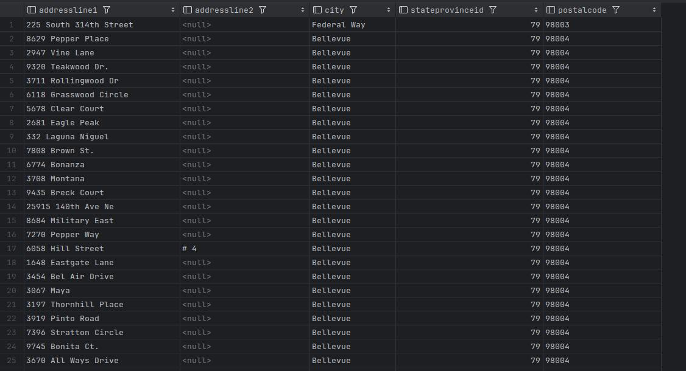
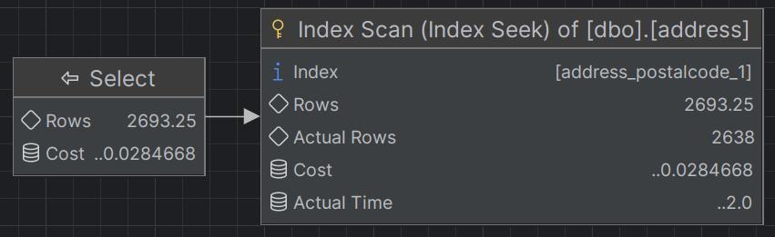
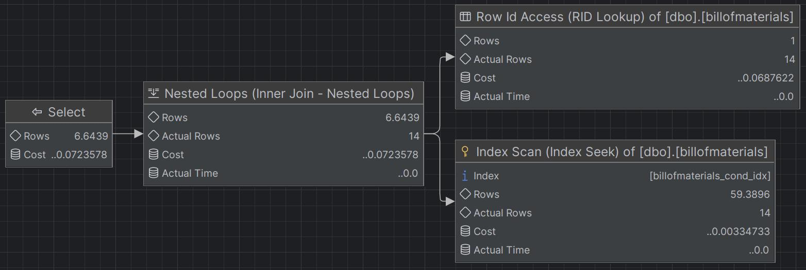

# Indeksy,  optymalizator <br>Lab 5

<!-- <style scoped>
 p,li {
    font-size: 12pt;
  }
</style>  -->

<!-- <style scoped>
 pre {
    font-size: 8pt;
  }
</style>  -->


---

**Imię i nazwisko: Bartlomiej Chwast, Jakub Domogała **

--- 

Celem ćwiczenia jest zapoznanie się z planami wykonania zapytań (execution plans), oraz z budową i możliwością wykorzystaniem indeksów (cz. 2.)

Swoje odpowiedzi wpisuj w miejsca oznaczone jako:

---
> Wyniki: 

```sql
--  ...
```

---

Ważne/wymagane są komentarze.

Zamieść kod rozwiązania oraz zrzuty ekranu pokazujące wyniki, (dołącz kod rozwiązania w formie tekstowej/źródłowej)

Zwróć uwagę na formatowanie kodu

## Oprogramowanie - co jest potrzebne?

Do wykonania ćwiczenia potrzebne jest następujące oprogramowanie
- MS SQL Server,
- SSMS - SQL Server Management Studio    
- przykładowa baza danych AdventureWorks2017.
    
Oprogramowanie dostępne jest na przygotowanej maszynie wirtualnej


## Przygotowanie  

Uruchom Microsoft SQL Managment Studio.
    
Stwórz swoją bazę danych o nazwie XYZ. 

```sql
create database lab5  
go  
  
use lab5  
go
```


## Dokumentacja/Literatura

Obowiązkowo:

- [https://docs.microsoft.com/en-us/sql/relational-databases/indexes/indexes](https://docs.microsoft.com/en-us/sql/relational-databases/indexes/indexes)
- [https://docs.microsoft.com/en-us/sql/relational-databases/sql-server-index-design-guide](https://docs.microsoft.com/en-us/sql/relational-databases/sql-server-index-design-guide)
- [https://www.simple-talk.com/sql/performance/14-sql-server-indexing-questions-you-were-too-shy-to-ask/](https://www.simple-talk.com/sql/performance/14-sql-server-indexing-questions-you-were-too-shy-to-ask/)

Materiały rozszerzające:
- [https://www.sqlshack.com/sql-server-query-execution-plans-examples-select-statement/](https://www.sqlshack.com/sql-server-query-execution-plans-examples-select-statement/)

<div style="page-break-after: always;"></div>

# Zadanie 1 - Indeksy klastrowane I nieklastrowane

Skopiuj tabelę `Customer` do swojej bazy danych:

```sql
select * into customer from adventureworks2017.sales.customer
```

Wykonaj analizy zapytań:

```sql
select * from customer where storeid = 594  
  
select * from customer where storeid between 594 and 610
```

Zanotuj czas zapytania oraz jego koszt koszt:

---
> Dla pierwszego zapytania ~ 80ms, koszt 0.139


Dla drugiego zapytania ~ 90ms, koszt 0.139


---

Dodaj indeks:

```sql
create  index customer_store_cls_idx on customer(storeid)
```

Jak zmienił się plan i czas? Czy jest możliwość optymalizacji?

---
> Dla pierwszego zapytania - czas bez większych zmian, koszt 0.00657

Dla drugiego zapytania ~ 80ms, koszt 0.0507

W obu przypadkach w planach pojawiły się skany indeksowe i prejście pętlą po stukturach.
---

Dodaj indeks klastrowany:

```sql
create clustered index customer_store_cls_idx on customer(storeid)
```

Czy zmienił się plan i czas? Skomentuj dwa podejścia w wyszukiwaniu krotek.

---
> Dla pierwszego zapytania ~ 70ms, koszt 0.00328

Dla drugiego zapytania ~ 70ms, koszt 0.0033

W obu przypadkach w plany ograniczyły się tylko do skanów indeksowych, ponieważ indeksy klastrowe reprezentują
jak rozmieszczone są dane na dysku. Koszty zapytań są najniższe przy zastosowaniu indeksów klastrowych,
dla takiego prostego zastosowania jak w przykładzie są bardzo wydajnym rozwiązaniem.
---


# Zadanie 2 – Indeksy zawierające dodatkowe atrybuty (dane z kolumn)

Celem zadania jest poznanie indeksów z przechowujących dodatkowe atrybuty (dane z kolumn)

Skopiuj tabelę `Person` do swojej bazy danych:

```sql
select businessentityid  
      ,persontype  
      ,namestyle  
      ,title  
      ,firstname  
      ,middlename  
      ,lastname  
      ,suffix  
      ,emailpromotion  
      ,rowguid  
      ,modifieddate  
into person  
from adventureworks2017.person.person
```
---

Wykonaj analizę planu dla trzech zapytań:

```sql
select * from [person] where lastname = 'Agbonile'  
  
select * from [person] where lastname = 'Agbonile' and firstname = 'Osarumwense'  
  
select * from [person] where firstname = 'Osarumwense'
```

Co można o nich powiedzieć?

---
>
>1.
>
>2.
>
>3.
>
W każdym przypadku plany zapytania wyglądają strukturalnie tak samo - pełny skan tabeli, mają takie same koszty,
natomiast różnią się ilośći przeskanowanych wierszy
---

Przygotuj indeks obejmujący te zapytania:

```sql
create index person_first_last_name_idx  
on person(lastname, firstname)
```

Sprawdź plan zapytania. Co się zmieniło?

---
>1.
>
>2.
>
>3.
>
Sytuacja wygląda podobnie jak w zadaniu pierwszym, w planach pojawiły się skan indeksowy oraz pętla z łączeniem wyników.
Dla dwóch pierwszych zapytań wyraźnie zmalał koszt, we wszystkich trzech pobieramy tylko jeden wierszy z tabeli.
---

Przeprowadź ponownie analizę zapytań tym razem dla parametrów: `FirstName = ‘Angela’` `LastName = ‘Price’`. (Trzy zapytania, różna kombinacja parametrów). 

Czym różni się ten plan od zapytania o `'Osarumwense Agbonile'` . Dlaczego tak jest?

---
>1.
>
>2.
>
>3.
>
W pierwszym i ostatnim zapytaniu indeks nie jest w ogóle wykorzystywany, wykonywany jest pełny skan tabeli. W przypadku
pierwszego imienia i nazwiska mieliśmy tylko jeden rekord spełniający każde z zapytań. W drugim przypadku mamy dużo więcej 
osób o danych imionach i nazwiskach osobno, dla takich danych planer stwierdził, że przejście po indeksach i wykonywanie
RID Lookupu nie będzie opłacalne względem przejścia przez wszystkie wiersze w tabeli.
---


# Zadanie 3

Skopiuj tabelę `PurchaseOrderDetail` do swojej bazy danych:

```sql
select * into purchaseorderdetail from  adventureworks2017.purchasing.purchaseorderdetail
```

Wykonaj analizę zapytania:

```sql
select rejectedqty, ((rejectedqty/orderqty)*100) as rejectionrate, productid, duedate  
from purchaseorderdetail  
order by rejectedqty desc, productid asc
```

---
>Wynik

Plan

Zapytanie składa się z pełnego skanu tabeli i posortowania danych.
---

Która część zapytania ma największy koszt?

---
>Operacja **Sort** ma największy koszt - 0.527433 względem 0.528317 dla całego zapytania.
---

Jaki indeks można zastosować aby zoptymalizować koszt zapytania? Przygotuj polecenie tworzące index.

---
>Można zastosować indeks założony bezpośrednio na kolumny według których sortowane są wiersze w zapytaniu.
>```sql
>create index purchaseorderdetail_rejectedqty_desc_productid_asc_idx
>on purchaseorderdetail (rejectedqty desc, productid asc) include (orderqty, duedate);
>```
---

 Ponownie wykonaj analizę zapytania:

---
>Wynik

Plan

Operacje **Sort** i **Full Scan** zostały zastąpione przez **Full Index Scan**, zredukowało to koszt zapytania do 0.0406.
---

# Zadanie 4

Celem zadania jest porównanie indeksów zawierających wszystkie kolumny oraz indeksów przechowujących dodatkowe dane (dane z kolumn).

Skopiuj tabelę `Address` do swojej bazy danych:

```sql
select * into address from  adventureworks2017.person.address
```

W tej części będziemy analizować następujące zapytanie:

```sql
select addressline1, addressline2, city, stateprovinceid, postalcode  
from address  
where postalcode between n'98000' and n'99999'
```

```sql
create index address_postalcode_1  
on address (postalcode)  
include (addressline1, addressline2, city, stateprovinceid);  
go  
  
create index address_postalcode_2  
on address (postalcode, addressline1, addressline2, city, stateprovinceid);  
go
```


Czy jest widoczna różnica w zapytaniach? Jeśli tak to jaka? Aby wymusić użycie indeksu użyj `WITH(INDEX(Address_PostalCode_1))` po `FROM`:

---
> Wyniki:\
> Brak indeksu

> 1.
>
> 2.
>
Plany:\
> Brak indeksu

> 1.
>
> 2.
>
Pomiędzy zapytaniami jest różnica w posortowaniu wyników, dla drugiego indeksu wiersze posortowane są w porządku leksykograficznym 
względem kolumn *postalcode*, *addressline1*, *addressline2*, *city* i *stateprovinceid*, gdzie dla pierwszego tylko względem 
kolumny *postalcode*. Plany zapytania z użyciem indeksów wyglądaja identycznie i mają **Index Scan** zamiast **Full Scan**.
---


Sprawdź rozmiar Indeksów:

```sql
select i.name as indexname, sum(s.used_page_count) * 8 as indexsizekb  
from sys.dm_db_partition_stats as s  
inner join sys.indexes as i on s.object_id = i.object_id and s.index_id = i.index_id  
where i.name = 'address_postalcode_1' or i.name = 'address_postalcode_2'  
group by i.name  
go
```


Który jest większy? Jak można skomentować te dwa podejścia do indeksowania? Które kolumny na to wpływają?

---
>\
Indeks **address_postalcode_2** jest większy. Wszystkie kolumny użyte do stworzenia tego indeksu są częścią B-drzewa, 
w przeciwieństwie do pierwszego indeksu, w którym do budowy B-drzewa wykorzystano tylko kolumnę *postalcode*. Drugiego 
indeksu warto używać gdy będziemy korzystać z wielu kolumn w warunku **WHERE**, wtedy zyski czasowe zrekompensują koszty 
pamięciowe. Pierwszego indeksu warto używać, gdy w warunku **WHERE** będzie tylko kolumna *postalcode* ze względu na 
mniejszą ilość zajmowanej pamięci.
---


# Zadanie 5 – Indeksy z filtrami

Celem zadania jest poznanie indeksów z filtrami.

Skopiuj tabelę `BillOfMaterials` do swojej bazy danych:

```sql
select * into billofmaterials  
from adventureworks2017.production.billofmaterials
```


W tej części analizujemy zapytanie:

```sql
select productassemblyid, componentid, startdate  
from billofmaterials  
where enddate is not null  
    and componentid = 327  
    and startdate >= '2010-08-05'
```

---
> Wynik

Plan

---

Zastosuj indeks:

```sql
create nonclustered index billofmaterials_cond_idx  
    on billofmaterials (componentid, startdate)  
    where enddate is not null
```

Sprawdź czy działa. 

Przeanalizuj plan dla poniższego zapytania:

Czy indeks został użyty? Dlaczego?

---
> Wynik

Plan

Wynik i plan identyczne jak obecności indeksu na tabeli, widać że indeks nie został użyty
---

Spróbuj wymusić indeks. Co się stało, dlaczego takie zachowanie?

---
> Wynik

Plan

Wynik bez zmian, w planie widać użycie indeksu, natomiast koszt zapytania wzrósł z 0.0203 do 0.0724. Stało się tak,
ponieważ w indeksie brakuje konstrukcji **include(productassemblyid)** przez co konieczne jest wykonywanie operacji
**Row Id Access**, zatem bez wymuszania indeksu planer decyduje się na nie wykorzystywanie go.
---


---

Punktacja:

|         |     |
| ------- | --- |
| zadanie | pkt |
| 1       | 2   |
| 2       | 2   |
| 3       | 2   |
| 4       | 2   |
| 5       | 2   |
| razem   | 10  |
