# Indeksy, optymalizator <br>Lab 6-7

<!-- <style scoped>
 p,li {
    font-size: 12pt;
  }
</style>  -->

<!-- <style scoped>
 pre {
    font-size: 8pt;
  }
</style>  -->

---

**Imię i nazwisko: Bartłomiej Chwast, Jakub Domogała**

---

Celem ćwiczenia jest zapoznanie się z planami wykonania zapytań (execution plans), oraz z budową i możliwością wykorzystaniem indeksów (cz. 2.)

Swoje odpowiedzi wpisuj w miejsca oznaczone jako:

---

> Wyniki:

```sql
--  ...
```

---

Ważne/wymagane są komentarze.

Zamieść kod rozwiązania oraz zrzuty ekranu pokazujące wyniki, (dołącz kod rozwiązania w formie tekstowej/źródłowej)

Zwróć uwagę na formatowanie kodu

## Oprogramowanie - co jest potrzebne?

Do wykonania ćwiczenia potrzebne jest następujące oprogramowanie

- MS SQL Server,
- SSMS - SQL Server Management Studio
  - lub inne
- przykładowa baza danych AdventureWorks2017.

Oprogramowanie dostępne jest na przygotowanej maszynie wirtualnej

## Przygotowanie

Stwórz swoją bazę danych o nazwie lab6.

```sql
create database lab6
go

use lab6
go
```

## Dokumentacja

Obowiązkowo:

- [https://docs.microsoft.com/en-us/sql/relational-databases/indexes/indexes](https://docs.microsoft.com/en-us/sql/relational-databases/indexes/indexes)
- [https://docs.microsoft.com/en-us/sql/relational-databases/indexes/create-filtered-indexes](https://docs.microsoft.com/en-us/sql/relational-databases/indexes/create-filtered-indexes)

# Zadanie 1

Skopiuj tabelę Product do swojej bazy danych:

```sql
  select * into product from adventureworks2017.production.product
```

Stwórz indeks z warunkiem przedziałowym:

```sql
create nonclustered index product_range_idx
    on product (productsubcategoryid, listprice) include (name)
where productsubcategoryid >= 27 and productsubcategoryid <= 36
```

Sprawdź, czy indeks jest użyty w zapytaniu:

```sql
select name, productsubcategoryid, listprice
from product
where productsubcategoryid >= 27 and productsubcategoryid <= 36
```

---

> 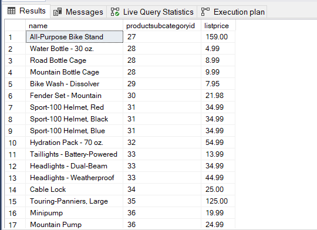 > 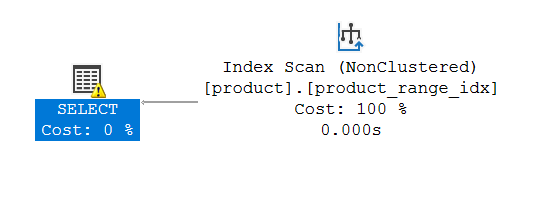\

## Indeks został użyty w zapytaniu

Sprawdź, czy indeks jest użyty w zapytaniu, który jest dopełnieniem zbioru:

```sql
select name, productsubcategoryid, listprice
from product
where productsubcategoryid < 27 or productsubcategoryid > 36
```

---

> 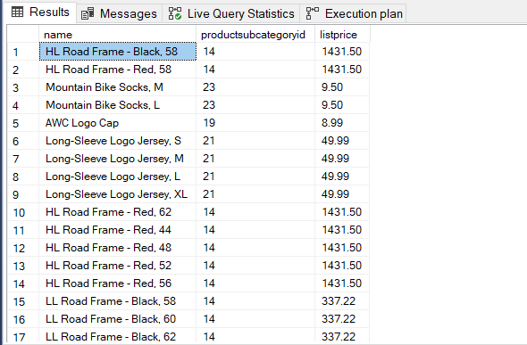 > 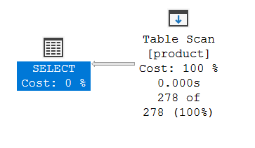\

## Indeks nie został użyty w zapytaniu

Skomentuj oba zapytania. Czy indeks został użyty w którymś zapytaniu, dlaczego? Czy indeks nie został użyty w którymś zapytaniu, dlaczego? Jak działają indeksy z warunkiem?

---

> Indeks został użyty tylko w pierwszym zapytaniu, ponieważ został on założony tylko na wybranych wierszach.
> W drugim zapytaniu wybieramy wiersze z poza zakresu z warunku indeksu, więc indeks nie jest używany.
> Indeksy z warunkiem dotyczą tylko wierszy spełniający zadany predykat, takie indeksy zajmują mniej miejsca na dysku

## i są prostsze w utrzymaniu. Wykorzystywane są do optymalizowania zapytania o konkretny podzbiór wierszy z tabeli.

# Zadanie 2 – indeksy klastrujące

Celem zadania jest poznanie indeksów klastrujących

Skopiuj ponownie tabelę SalesOrderHeader do swojej bazy danych:

```sql
select * into salesorderheader2 from adventureworks2017.sales.salesorderheader
```

Wypisz sto pierwszych zamówień:

```sql
select top 100 * from salesorderheader2
order by orderdate
```

---

> 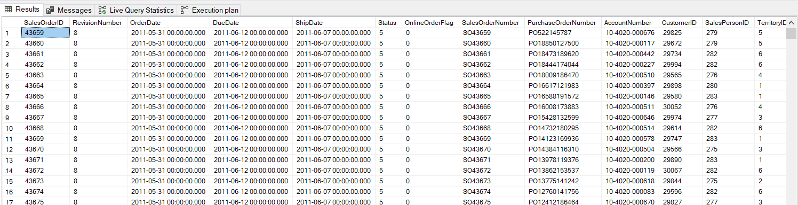

## 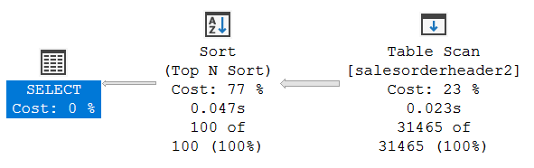

Stwórz indeks klastrujący według OrderDate:

```sql
create clustered index order_date2_idx on salesorderheader2(orderdate)
```

Wypisz ponownie sto pierwszych zamówień. Co się zmieniło?

---

> 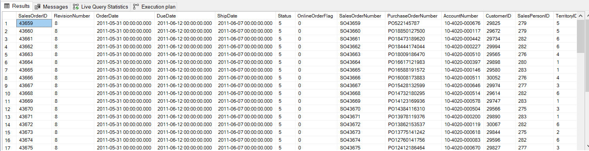 > 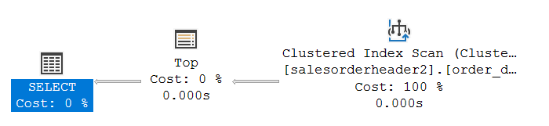
> Zapytanie zwróciło taki sam wynik, natomiast patrząc na plan, można zauważyć brak sortowania danych, ponieważ dzięki
> zastosowaniu indeksu klastrowanego według kolumny _orderdate_, dane zostały przeorganizowane na dysku i są już wyjściowo

## posortowane.

Sprawdź zapytanie:

```sql
select top 1000 * from salesorderheader2
where orderdate between '2010-10-01' and '2011-06-01'
```

---

> 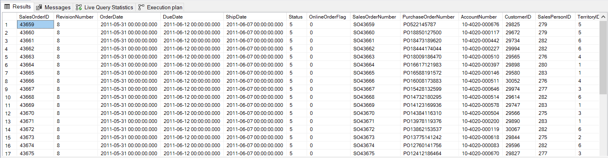

## 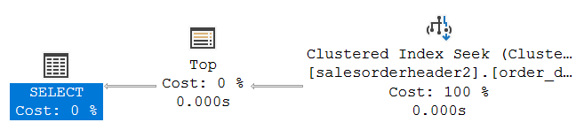

Dodaj sortowanie według OrderDate ASC i DESC. Czy indeks działa w obu przypadkach. Czy wykonywane jest dodatkowo sortowanie?

---

> ASC
> 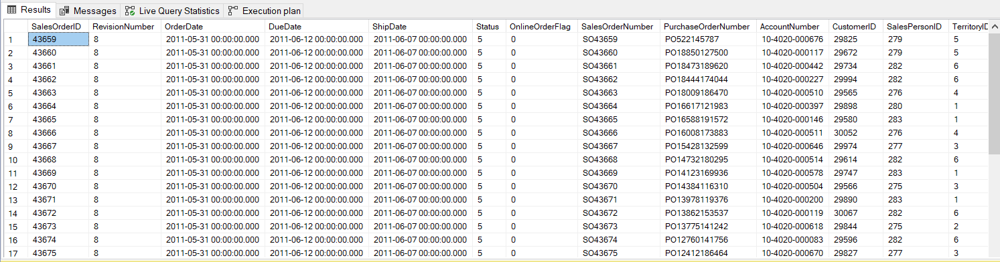 > 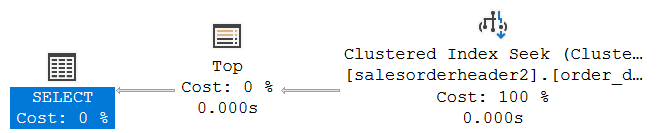\
> DESC
> 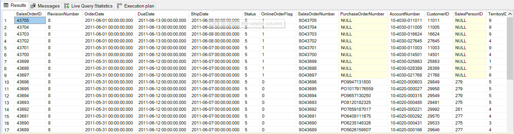 > 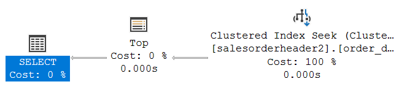\

## W obu przypadkach indeks zadziałał, dodatkowe sortowanie nie jest wykonywane.

# Zadanie 3 – indeksy column store

Celem zadania jest poznanie indeksów typu column store

Utwórz tabelę testową:

```sql
create table dbo.saleshistory(
 salesorderid int not null,
 salesorderdetailid int not null,
 carriertrackingnumber nvarchar(25) null,
 orderqty smallint not null,
 productid int not null,
 specialofferid int not null,
 unitprice money not null,
 unitpricediscount money not null,
 linetotal numeric(38, 6) not null,
 rowguid uniqueidentifier not null,
 modifieddate datetime not null
 )
```

Załóż indeks:

```sql
create clustered index saleshistory_idx
on saleshistory(salesorderdetailid)
```

Wypełnij tablicę danymi:

(UWAGA `GO 100` oznacza 100 krotne wykonanie polecenia. Jeżeli podejrzewasz, że Twój serwer może to zbyt przeciążyć, zacznij od GO 10, GO 20, GO 50 (w sumie już będzie 80))

```sql
insert into saleshistory
 select sh.*
 from adventureworks2017.sales.salesorderdetail sh
go 100
```

---

> 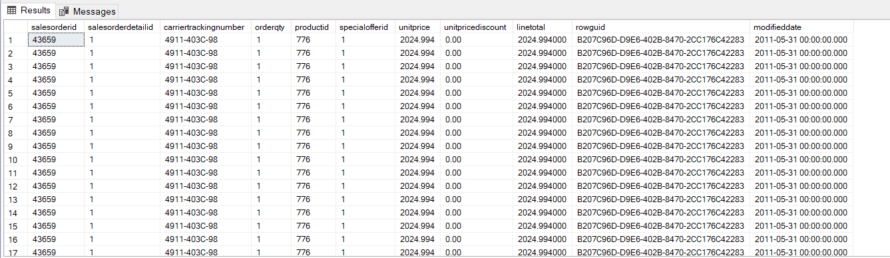

---

Sprawdź jak zachowa się zapytanie, które używa obecny indeks:

```sql
select productid, sum(unitprice), avg(unitprice), sum(orderqty), avg(orderqty)
from saleshistory
group by productid
order by productid
```

---

> 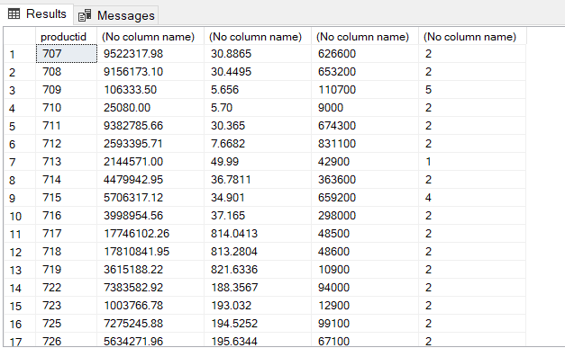

## 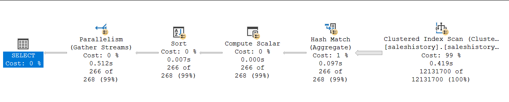

Załóż indeks typu ColumnStore:

```sql
create nonclustered columnstore index saleshistory_columnstore
 on saleshistory(unitprice, orderqty, productid)
```

Sprawdź różnicę pomiędzy przetwarzaniem w zależności od indeksów. Porównaj plany i opisz różnicę.

---

> 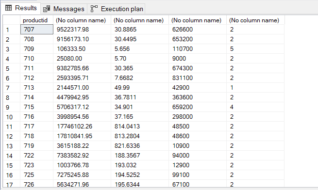 > 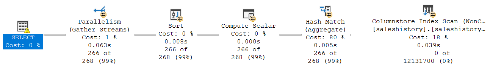\
> W obu przypadkach zapytanie zwróciło taki sam wynik, natomiast patrząc na plan, można zauważyć, że w przypadku indeksu kolumnowego

## krok **Hash Match** relatywnie był dużo bardziej kosztowny niż w zapytaniu z indeksem klastrowanym.

# Zadanie 4 – własne eksperymenty

Należy zaprojektować tabelę w bazie danych, lub wybrać dowolny schemat danych (poza używanymi na zajęciach), a następnie wypełnić ją danymi w taki sposób, aby zrealizować poszczególne punkty w analizie indeksów. Warto wygenerować sobie tabele o większym rozmiarze.

Do analizy, proszę uwzględnić następujące rodzaje indeksów:

- Klastrowane (np.  dla atrybutu nie będącego kluczem głównym)
- Nieklastrowane
- Indeksy wykorzystujące kilka atrybutów, indeksy include
- Filtered Index (Indeks warunkowy)
- Kolumnowe

## Analiza

Proszę przygotować zestaw zapytań do danych, które:

- wykorzystują poszczególne indeksy
- które przy wymuszeniu indeksu działają gorzej, niż bez niego (lub pomimo założonego indeksu, tabela jest w pełni skanowana)
  Odpowiedź powinna zawierać:
- Schemat tabeli
- Opis danych (ich rozmiar, zawartość, statystyki)
- Trzy indeksy:
- Opis indeksu
- Przygotowane zapytania, wraz z wynikami z planów (zrzuty ekranow)
- Komentarze do zapytań, ich wyników
- Sprawdzenie, co proponuje Database Engine Tuning Advisor (porównanie czy udało się Państwu znaleźć odpowiednie indeksy do zapytania)

> Wyniki:

### Zestaw danych

Tabela to kopia tabeli PurchaseOrderDetail -> AdventureWorks2017.Purchasing.PurchaseOrderDetail, jednak jest ona wielokrotnie większa (3 miliony wierszy).

```sql
create table dbo.purchaseorderdetail2(
 PurchaseOrderID int not null,
 PurchaseOrderDetailID int not null,
 DueDate datetime not null,
 OrderQty int not null,
 ProductID int not null,
 UnitPrice money not null,
 [Line Total] numeric(38, 6) not null,
 ReceivedQty int not null,
 RejectedQty int not null,
 StockedQty int not null,
 ModifiedDate datetime not null
 )
```

```sql
select top 10 * from purchaseorderdetail2
```

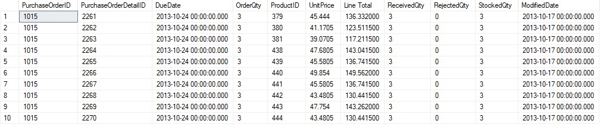

```sql
select count(*) as count from purchaseOrderDetail2
```

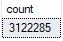

### Part 1

zapytanie

```sql
select OrderQty, ReceivedQty, RejectedQty
from purchaseorderdetail2
where OrderQty < 200 and ReceivedQty * 0.5 < RejectedQty
```

Przy naszej wielkości tabeli wyniki mają rozmiar ponad 22000 wierszy.

Wywołanie bez indeksu

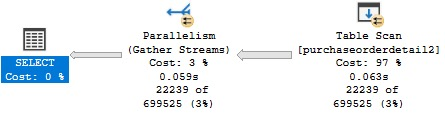

Stworzenie indeksu

```sql
create nonclustered index orderqty_idx
    on purchaseOrderDetail2 (OrderQty, ReceivedQty, RejectedQty)
where OrderQty < 200
```

Zwykłe wywołanie po stworzeniu indeksu

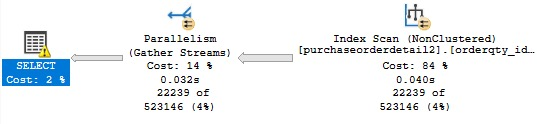

Koszt Index skan jest mniejszy niz wcześniej widziany table Scan jednak o wiele większy koszt mamy teraz nałozony na krok Gather Streams.

Wywołanie z wymuszeniem uzycia indeksu

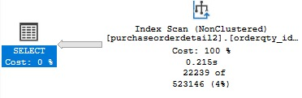

Wywołanie po stworzeniu indeksu jest o 60% szybsze niz bez indeksu, gdy wymusimy uzycie indeksu execution plan zmienia się dając o wiele gorsze wyniki.

### Part 2

Stworzenie indeksu clustered

```sql
create clustered index orderqty_idx_clu
    on purchaseOrderDetail2 (OrderQty, ReceivedQty, RejectedQty)
```

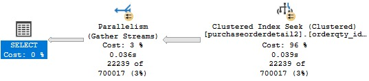

W tym przypadku zwykłe wywołanie zapytania samo z siebie uzywa stworzonego indeksu.
Czas wywołania jest podobny do tego z indeksem nonclustered.
Wymuszenie uzycia indeksu daje takie same rezultaty.
Koszt Gather Streams wrócił do niskiego poziomu jednak Clustered Inex Seek ma duzo wyzszy koszt.

### Part 3

Wywołanie zapytania bez indeksu


Stworzenie indeksu nonclustered nonfiltered

```sql
create nonclustered index orderqty_idx_norm
    on purchaseOrderDetail2 (OrderQty, ReceivedQty, RejectedQty)
```

Wywołanie po stworzeniu indeksu

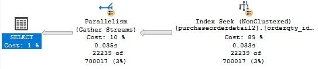

Wywołanie z wymuszeniem indeksu


W tym przypadku indeks równiez zostaje uzyty automatycznie, nie musimy go wymuszać, otrzymane wyniki są podobne jak w przypadku indeksu clustered.
Wyniki dostajemy około 60% szybciej, koszt równiez jest nizszy.

| | | | |
| ------- | --- | --- | --- |
| zadanie | pkt | | |
| 1 | 2 | | |
| 2 | 2 | | |
| 3 | 2 | | |
| 4 | 10 | | |
| razem | 16 | | |
